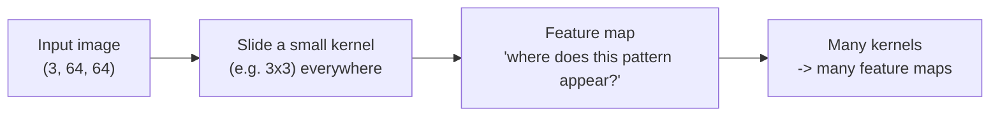

# 01 — Convolutions and Pooling

> In Week 2 we flattened every galaxy into a 12 288-number vector and watched a fully-connected network struggle, because flattening throws away the one thing that *defines* a galaxy: its **spatial structure**. This week we fix that. The **convolution** is the operation that lets a network look at an image *as an image* — finding arms, edges, and bulges wherever they appear. It is the "C" in CNN.

---

## The Problem with Flattening (a 30-Second Recap)

A `(3, 64, 64)` galaxy image is a grid: each pixel sits next to its neighbours, and "next to" is meaningful — a spiral arm is a *local* pattern of bright pixels curving through darker ones. When Week 2's MLP called `nn.Flatten()`, it stretched that grid into one long row of 12 288 numbers. Pixel `(0, 0)` and pixel `(0, 1)` — touching neighbours — end up no more related than pixel `(0, 0)` and pixel `(63, 63)` on the opposite corner.

The MLP can still *learn*, but it has to rediscover "these pixels are neighbours" from scratch, using a separate weight for every single pixel. That is why its first layer needed **1.57 million** parameters — and it still can't naturally recognise a spiral arm that has shifted a few pixels to the left.

A convolution keeps the grid intact and exploits the neighbour relationship directly.

---

## What a Convolution Does

A **convolution** slides a small window — called a **kernel** or **filter** — across the image. At each position, it multiplies the kernel's numbers by the pixels underneath, sums the result into a single number, and writes that number to an output grid. Slide, multiply, sum, repeat.

```
Image patch (3x3)        Kernel (3x3)          Output
┌─────────────┐          ┌──────────┐
│  10  10  10 │          │ -1 -1 -1 │
│  10  50  10 │   ·×·    │ -1  8 -1 │   ─►   one number
│  10  10  10 │          │ -1 -1 -1 │
└─────────────┘          └──────────┘
   (the pixels)           (learnable weights)
```

That single output number says "**how strongly does the pattern in this kernel appear at this spot?**". The kernel above is an edge/blob detector: it fires when a bright centre sits on a darker background. Slide it everywhere and you get a whole grid of "how much does this look like a bright blob?" responses — a **feature map**.

The crucial difference from a `Linear` layer: a convolution uses the **same small kernel** at every position. The kernel above has just 9 weights, and those 9 weights are reused across all 64×64 positions.



Text fallback: a small kernel slides over the input image; at each position it produces one number measuring how strongly its pattern matches, building a feature map; using many kernels produces many feature maps (one per learned pattern).

### Two properties that make convolutions perfect for galaxies

- **Translation equivariance.** Because the same kernel is applied everywhere, a spiral arm in the top-left and the *same* arm in the bottom-right produce the *same* response, just in a different spot. The network learns the pattern **once** and finds it anywhere. An MLP would have to learn it separately for every location.
- **Parameter sharing.** Those 9 (or 27) weights are reused across the whole image, so a convolutional layer has *far* fewer parameters than the equivalent fully-connected layer — and generalises better.

---

## `nn.Conv2d` in PyTorch

The 2D convolution layer is `nn.Conv2d`. The four arguments you actually set:

```python
import torch.nn as nn

conv = nn.Conv2d(
    in_channels=3,    # input channels: 3 for an RGB galaxy
    out_channels=16,  # how many kernels (= how many feature maps out)
    kernel_size=3,    # each kernel is 3x3
    padding=1,        # pad the border so output H,W match input H,W
)
```

| Argument | What it means | Typical value |
|---|---|---|
| `in_channels` | Channels of the **input**. First layer: 3 (RGB). Later layers: the previous layer's `out_channels`. | 3, then 16, 32, … |
| `out_channels` | Number of **kernels**, hence number of feature maps produced. More = more patterns the layer can detect. | 8, 16, 32, 64 |
| `kernel_size` | Side length of each (square) kernel. | 3 (most common), 5 |
| `stride` | How many pixels the kernel jumps each slide. `1` = every pixel. | 1 (default) |
| `padding` | Zeros added around the border so edge pixels get a fair share. `padding=1` with `kernel_size=3` keeps `H, W` unchanged. | 1 |

> **Channels are not the same as the batch dimension.** A `Conv2d` operates on a `(B, C, H, W)` tensor: `B` images in the batch, each with `C` channels, height `H`, width `W`. The convolution mixes across the `C` channels but slides spatially over `H` and `W`. Output shape is `(B, out_channels, H_out, W_out)`.

### The output-size formula

For a square input of side `W_in`:

```
W_out = floor((W_in + 2*padding - kernel_size) / stride) + 1
```

The case you'll use most: `kernel_size=3, padding=1, stride=1` gives `W_out = W_in` — the spatial size is **preserved**. That's why `padding=1` pairs with `3x3` kernels so often. Memorise that combo; it removes most shape headaches.

```python
import torch
x = torch.randn(8, 3, 64, 64)          # (B, C, H, W)
conv = nn.Conv2d(3, 16, kernel_size=3, padding=1)
print(conv(x).shape)                   # torch.Size([8, 16, 64, 64])
```

The channel count went 3 → 16 (we asked for 16 kernels); the 64×64 spatial size stayed because `padding=1` with a 3×3 kernel. Each of the 16 output channels is one feature map from one learned kernel.

### How many parameters?

A `Conv2d(in_channels, out_channels, k)` has `out_channels × in_channels × k × k` weights plus `out_channels` biases. For `Conv2d(3, 16, 3)`:

```
16 × 3 × 3 × 3 + 16 = 432 + 16 = 448 parameters
```

Compare that to Week 2's first `Linear` layer at **1.57 million**. A convolution sees the *whole* 64×64 image with 448 weights, because it reuses the same kernels everywhere. This is the single biggest reason CNNs beat MLPs on images.

---

## Pooling: Shrinking While Keeping What Matters

After a convolution we usually **downsample** the feature maps with **pooling**. Pooling slides a small window (typically 2×2) and replaces each window with a single summary number. **Max pooling** keeps the maximum:

```
Feature map (4x4)              MaxPool2d(2)            Output (2x2)
┌───────────────┐
│  1  3 │ 2  0  │              take the max
│  4  2 │ 1  5  │    ──────►   of each 2x2 block   ──►   ┌──────┐
│───────┼────── │                                        │ 4  5 │
│  0  1 │ 6  2  │                                        │ 1  6 │
│  1  0 │ 3  1  │                                        └──────┘
└───────────────┘
```

```python
pool = nn.MaxPool2d(kernel_size=2, stride=2)
x = torch.randn(8, 16, 64, 64)
print(pool(x).shape)        # torch.Size([8, 16, 32, 32])
```

A 2×2 max-pool **halves** height and width (64 → 32) and leaves the channel count alone. Why bother?

- **Fewer numbers to process** downstream — each pool quarters the spatial area, so the network gets cheaper as it goes deeper.
- **A little translation invariance** — if the brightest pixel of an arm wobbles by one position, the max over the 2×2 block often stays the same.
- **A growing receptive field** — after pooling, each later kernel effectively "sees" a larger region of the original image, letting deep layers detect bigger structures (a whole arm, not just an edge).

Pooling has **no learnable parameters** — it's a fixed rule (take the max). There is also `nn.AvgPool2d` (takes the mean); max-pooling is the more common default for classification.

---

## The Repeating Motif: Conv → ReLU → Pool

CNNs are built by stacking the same little block, each time detecting more abstract features over a smaller grid:


Text fallback: input `(B,3,64,64)` → Conv 3→16 + ReLU → MaxPool → `(B,16,32,32)` → Conv 16→32 + ReLU → MaxPool → `(B,32,16,16)` → eventually flatten and feed a small Linear classifier head (covered on page 02).

Notice the pattern: **channels go up** (3 → 16 → 32; the network tracks more kinds of pattern) while **spatial size goes down** (64 → 32 → 16; pooling summarises). The `ReLU` is the same non-linearity from Week 2 — without it, stacked convolutions would collapse into one linear operation.

> **Early layers vs late layers.** Kernels in the first conv layer learn simple, local things: edges, colour blobs, bright spots. Deeper layers combine those into curves, arm segments, and eventually whole-galaxy "is this smooth or structured?" detectors. Nobody programs these — they *emerge* from training (Week 3 page 03). Page 04 explains what real galaxy features (arms, dust lanes, H II regions) those kernels end up keying on.

---

## Convolution vs Fully-Connected: The Scorecard

| | Fully-connected (`nn.Linear`, Week 2) | Convolutional (`nn.Conv2d`, Week 3) |
|---|---|---|
| Input | Flattened vector `(B, 12288)` | Image grid `(B, 3, 64, 64)` |
| Spatial structure | **Destroyed** by flattening | **Preserved** |
| Weights | One per input→output connection | A few small shared kernels |
| First-layer params (our case) | ~1.57 million | ~448 |
| Finds a pattern that moved? | No — must relearn per location | Yes — same kernel everywhere |
| Good for | Tabular data, final classifier head | Images, audio, anything with local structure |

This is the headline of Week 3: **for images, convolutions are strictly the better tool**, and they're cheaper to boot.

---

## Common Pitfalls

| Symptom | Cause | Fix |
|---|---|---|
| `RuntimeError: expected 4-dimensional input` | Fed a flattened `(B, 12288)` vector to `Conv2d`. | `Conv2d` wants `(B, C, H, W)` — do **not** flatten before convolutions. |
| Channel mismatch `RuntimeError` | A layer's `in_channels` ≠ the previous layer's `out_channels`. | Chain them: `Conv2d(3,16,...)` then `Conv2d(16,32,...)`. |
| Spatial size shrinks unexpectedly | Used `kernel_size=3` with `padding=0`. | Add `padding=1` to keep `H, W` (with a 3×3 kernel). |
| Output huge / runs slowly | Too many `out_channels`, or no pooling to downsample. | Add `MaxPool2d(2)` between blocks; keep channel counts modest (16, 32, 64). |
| "Where did my batch dim go?" | Confused `out_channels` with batch size. | Output is `(B, out_channels, H_out, W_out)`; `B` never changes. |

---

## Quick Self-Check

1. In one sentence, what does a convolutional kernel compute at each position?
2. Why does a `Conv2d` have so many fewer parameters than the equivalent `Linear` layer?
3. You apply `nn.Conv2d(3, 16, kernel_size=3, padding=1)` to a `(8, 3, 64, 64)` tensor. What's the output shape?
4. What does `nn.MaxPool2d(2)` do to a `(8, 16, 64, 64)` tensor, and does it have learnable weights?
5. What does "translation equivariance" buy us when classifying galaxies?

<details>
<summary>Answers</summary>

1. It measures how strongly the kernel's learned pattern appears in the small image patch beneath it (multiply the kernel by the underlying pixels and sum to one number).
2. Because a convolution **reuses** the same small kernel at every spatial position (parameter sharing), whereas a `Linear` layer has a separate weight for every input–output pair.
3. `(8, 16, 64, 64)` — channels go 3 → 16, and `padding=1` with a 3×3 kernel preserves the 64×64 spatial size.
4. It halves the spatial dimensions to `(8, 16, 32, 32)` by taking the max of each 2×2 block; it has **no** learnable parameters.
5. A pattern (e.g. a spiral arm) is detected the same way no matter where it sits in the image, so the network learns it once and finds it anywhere — galaxies are not centred and oriented identically.

</details>

---

## External Resources

- 📘 [PyTorch — `nn.Conv2d` docs](https://docs.pytorch.org/docs/stable/generated/torch.nn.Conv2d.html) (read the shape and output-size notes).
- 📘 [PyTorch — `nn.MaxPool2d` docs](https://docs.pytorch.org/docs/stable/generated/torch.nn.MaxPool2d.html).
- 📘 [CS231n — Convolutional Networks notes](https://cs231n.github.io/convolutional-networks/) — the canonical, free explanation of conv, stride, padding, pooling.
- 📺 [3Blue1Brown — But what is a convolution?](https://www.youtube.com/watch?v=KuXjwB4LzSA).
- 📺 [StatQuest — Convolutional Neural Networks clearly explained](https://www.youtube.com/watch?v=HGwBXDKFk9I).
- 🛠️ [Convolution arithmetic animations (vdumoulin)](https://github.com/vdumoulin/conv_arithmetic) — see padding/stride visually.
- 📘 [The "CNN Explainer" interactive demo](https://poloclub.github.io/cnn-explainer/) — click through a live CNN in your browser.

---

➡️ Next: [`02-building-a-cnn.md`](02-building-a-cnn.md) | 📚 Week hub: [`README.md`](README.md)
