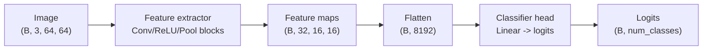

# 02 — Building a CNN

> Page 01 gave us the two new LEGO bricks: `nn.Conv2d` and `nn.MaxPool2d`. Now we snap them together into a real model — a `GalaxyCNN` — using the exact same `nn.Module` recipe from Week 2. The only genuinely new skill is **shape arithmetic**: tracking a tensor's shape as it flows through conv and pool layers so the flatten-and-classify head at the end gets the right number of inputs.

---

## The Anatomy of a Small CNN

Almost every image classifier has the same two-stage shape:

1. **A convolutional feature extractor** — a stack of `Conv → ReLU → Pool` blocks that turns the raw image into a compact stack of feature maps. Channels rise; spatial size falls.
2. **A classifier head** — a `Flatten` followed by one or two `Linear` layers that map those features to one score per class.



Text fallback: the image passes through convolutional blocks that produce a small stack of feature maps `(B, 32, 16, 16)`; we flatten that to `(B, 8192)` and pass it through `Linear` layers to get `(B, num_classes)` logits.

The feature extractor is the new part. The head is just the Week-2 MLP again — except now its input is *learned features*, not raw pixels, so it has a much easier job.

---

## Tracking Shapes (the One Skill That Matters)

The whole model hinges on one number: **how many features come out of the extractor**, because that's the `in_features` of the first `Linear` in the head. Get it wrong and you get a shape-mismatch `RuntimeError`. Let's trace it for a concrete two-block design on a `(B, 3, 64, 64)` input.

| Step | Layer | Output shape `(B, C, H, W)` | Why |
|---|---|---|---|
| in | — | `(B, 3, 64, 64)` | RGB galaxy |
| 1 | `Conv2d(3, 16, 3, padding=1)` + ReLU | `(B, 16, 64, 64)` | 16 kernels; `padding=1` keeps 64×64 |
| 2 | `MaxPool2d(2)` | `(B, 16, 32, 32)` | halves H, W |
| 3 | `Conv2d(16, 32, 3, padding=1)` + ReLU | `(B, 32, 32, 32)` | 32 kernels; size preserved |
| 4 | `MaxPool2d(2)` | `(B, 32, 16, 16)` | halves again |
| 5 | `Flatten` | `(B, 8192)` | `32 × 16 × 16 = 8192` |
| 6 | `Linear(8192, num_classes)` | `(B, num_classes)` | the logits |

So the magic number is `32 × 16 × 16 = 8192`. The rule of thumb: each 2×2 pool halves `H` and `W`; after `p` pools, a 64-pixel side becomes `64 / 2^p`. Two pools → 16. Multiply by the final channel count → flattened size.

```
flattened_features = final_channels × (64 / 2^num_pools)²
                    = 32 × (64 / 4)²
                    = 32 × 16 × 16
                    = 8192
```

> **Don't trust mental arithmetic — let PyTorch tell you.** Run a dummy batch through just the feature extractor and `print(x.shape)`. Whatever it prints (minus the batch dim) is your `Linear` input size. We show this trick below; it's the fastest way to avoid off-by-one shape bugs.

---

## Writing `GalaxyCNN`

Same recipe as Week 2: subclass `nn.Module`, build layers in `__init__`, define the data flow in `forward`. Call `super().__init__()` first.

```python
import torch
import torch.nn as nn

class GalaxyCNN(nn.Module):
    def __init__(self, num_classes=3):
        super().__init__()                                  # MUST be first
        # --- Feature extractor: two Conv -> ReLU -> Pool blocks ---
        self.features = nn.Sequential(
            nn.Conv2d(3, 16, kernel_size=3, padding=1),     # (B, 16, 64, 64)
            nn.ReLU(),
            nn.MaxPool2d(2),                                 # (B, 16, 32, 32)
            nn.Conv2d(16, 32, kernel_size=3, padding=1),    # (B, 32, 32, 32)
            nn.ReLU(),
            nn.MaxPool2d(2),                                 # (B, 32, 16, 16)
        )
        # --- Classifier head ---
        self.classifier = nn.Sequential(
            nn.Flatten(),                                    # (B, 8192)
            nn.Linear(32 * 16 * 16, 128),                    # (B, 128)
            nn.ReLU(),
            nn.Linear(128, num_classes),                     # (B, num_classes) logits
        )

    def forward(self, x):                                    # x: (B, 3, 64, 64)
        x = self.features(x)                                 # (B, 32, 16, 16)
        x = self.classifier(x)                               # (B, num_classes)
        return x
```

Two conveniences worth noting:

- **`nn.Sequential`** chains layers so you don't have to call them one by one in `forward`. It's optional sugar — you could write each layer as its own attribute and call them in order, exactly like the Week-2 MLP. Use whichever reads more clearly to you.
- **The output is raw logits.** Just like Week 2, the final `Linear` has **no** softmax or ReLU after it — `nn.CrossEntropyLoss` (page 03) applies the softmax internally.

### Verifying the model with a dummy batch

Before training anything, forward-pass fake data shaped like your real batch and check the output:

```python
model = GalaxyCNN(num_classes=3)
dummy = torch.randn(8, 3, 64, 64)        # 8 fake galaxies
logits = model(dummy)
print(logits.shape)                      # torch.Size([8, 3])  <- (B, num_classes)
```

If that prints `(8, 3)`, the whole pipeline (conv → pool → flatten → linear) lines up. If it raises a shape error, the `Linear`'s `in_features` doesn't match the flattened size — use the trick below to find the right number.

```python
# Find the flattened feature size empirically:
feat = model.features(dummy)             # run only the extractor
print(feat.shape)                        # torch.Size([8, 32, 16, 16])
print(feat.flatten(start_dim=1).shape)   # torch.Size([8, 8192]) -> Linear in_features = 8192
```

---

## How Many Parameters? (CNN vs MLP)

Counting weights makes the CNN's efficiency concrete:

```python
total = sum(p.numel() for p in model.parameters())
print(f"GalaxyCNN parameters: {total:,}")
```

Roughly where they live in our design:

| Layer | Parameters | Note |
|---|---|---|
| `Conv2d(3, 16, 3)` | `16·3·3·3 + 16 = 448` | sees the whole image with 448 weights |
| `Conv2d(16, 32, 3)` | `32·16·3·3 + 32 = 4 640` | still tiny |
| `Linear(8192, 128)` | `8192·128 + 128 ≈ 1.05 M` | the head dominates |
| `Linear(128, 3)` | `128·3 + 3 = 387` | classifier output |

The **convolutions are nearly free** (a few thousand weights) and do the hard visual work; the bulk of the parameters sit in the `Linear` head. Contrast Week 2's MLP, whose *first* layer alone was 1.57 M because it connected every one of 12 288 raw pixels to every hidden unit. The CNN spends its parameters more wisely — and, crucially, on *spatially-aware* features.

> **Want fewer head parameters?** Add a third Conv+Pool block (spatial size 64 → 32 → 16 → 8) so the flattened size becomes `64 × 8 × 8 = 4096`, or swap `nn.Flatten` for `nn.AdaptiveAvgPool2d(1)` to pool each channel to a single number. Both are great stretch experiments once the basic model trains.

---

## Design Choices, and Sensible Defaults

You will be tempted to fiddle. Here's what each knob does and a safe starting value:

| Choice | Effect | Sensible default for this project |
|---|---|---|
| Number of Conv+Pool blocks | More blocks = more abstraction, smaller final grid | 2 (or 3) |
| `out_channels` per block | More channels = more patterns, more compute | 16, then 32 (then 64) |
| `kernel_size` | 3×3 is the universal default | 3 with `padding=1` |
| Hidden width in the head | Capacity of the classifier | 128 |
| Activation | Non-linearity | `nn.ReLU` |

Resist the urge to build something huge. A two-block CNN trains in minutes on a Colab T4 and already crushes the Week-2 baseline. Add capacity only once the small model is working and you've diagnosed *why* you need more.

---

## Common Pitfalls

| Symptom | Cause | Fix |
|---|---|---|
| Shape-mismatch `RuntimeError` at the first `Linear` | `in_features` ≠ flattened extractor output. | Print `model.features(dummy).flatten(start_dim=1).shape` and use that number. |
| `RuntimeError: expected 4D input` at first `Conv2d` | Flattened the image before the convolutions. | Feed `(B, 3, 64, 64)` straight in; flatten **after** the conv blocks. |
| Forgot `super().__init__()` | Parameters not registered; model won't train or move to GPU. | First line of `__init__`. |
| Output isn't `(B, num_classes)` | No `Flatten` before the head, or wrong final `Linear`. | Ensure `Flatten` → `Linear(..., num_classes)` at the end. |
| Model trains but is enormous/slow | Too many channels or no pooling. | Keep 16/32 channels; pool between blocks. |
| Accidentally softmaxed the output | Added `nn.Softmax` to the head. | Return raw logits; `CrossEntropyLoss` handles softmax. |

---

## Quick Self-Check

1. What are the two stages of a typical image CNN, and what does each do?
2. For input `(B, 3, 64, 64)`, two `Conv(padding=1)+Pool(2)` blocks ending in 32 channels — what's the flattened feature size, and how do you derive it?
3. What's the fastest, least error-prone way to find the `in_features` for the first `Linear` in the head?
4. Where do most of `GalaxyCNN`'s parameters live, and why is that different from the Week-2 MLP?
5. Why is there no softmax on the final layer?

<details>
<summary>Answers</summary>

1. A **feature extractor** (stacked `Conv → ReLU → Pool` blocks that turn pixels into feature maps, raising channels and shrinking spatial size) and a **classifier head** (`Flatten` + `Linear` layers mapping features to per-class logits).
2. `32 × 16 × 16 = 8192`. Each 2×2 pool halves H and W, so after two pools a 64-pixel side is `64 / 2² = 16`; multiply by the 32 output channels.
3. Run a dummy batch through `model.features` and print `.flatten(start_dim=1).shape` — the second dimension is the `Linear` input size.
4. Most live in the first `Linear` of the head (~1.05 M); the convolutions are only a few thousand weights. Unlike the MLP, the CNN's *first* layer is a cheap convolution, not a dense layer over 12 288 raw pixels.
5. Because `nn.CrossEntropyLoss` (page 03) applies softmax internally and expects raw logits; adding softmax would apply it twice and break training.

</details>

---

## External Resources

- 📘 [PyTorch — `nn.Sequential` docs](https://docs.pytorch.org/docs/stable/generated/torch.nn.Sequential.html).
- 📘 [PyTorch — TRAINING A CLASSIFIER (CIFAR-10 CNN tutorial)](https://docs.pytorch.org/tutorials/beginner/blitz/cifar10_tutorial.html) — a near-identical small CNN, end to end.
- 📘 [CS231n — ConvNet architectures](https://cs231n.github.io/convolutional-networks/#architectures) — how layers are typically stacked.
- 📘 [PyTorch — Build the Neural Network](https://docs.pytorch.org/tutorials/beginner/basics/buildmodel_tutorial.html) — the `nn.Module` recipe we reuse.
- 📺 [Daniel Bourke — PyTorch computer vision (free)](https://www.learnpytorch.io/03_pytorch_computer_vision/) — builds a small CNN step by step.
- 📘 [CNN Explainer (interactive)](https://poloclub.github.io/cnn-explainer/) — watch shapes change layer by layer.

---

⬅️ Previous: [`01-convolutions-and-pooling.md`](01-convolutions-and-pooling.md) | ➡️ Next: [`03-the-training-loop.md`](03-the-training-loop.md)
