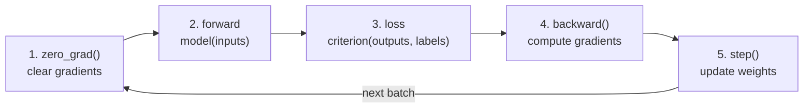
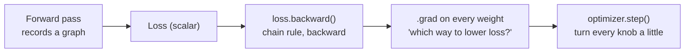

# 03 — The Training Loop

> We have a model (`GalaxyCNN`, page 02), a loss, and an optimiser (Week 2, page 05). Right now they sit idle. The **training loop** is the engine that puts them to work: it feeds batches through the model, measures how wrong it is, and nudges the weights — over and over — until the loss falls and the network actually learns. This is the single most important piece of code you'll write all track.

---

## The Five Steps, Forever

In Week 2 you ran three lines (`zero_grad → backward → step`) on a *single* batch and watched the loss drop once. Training is just that, wrapped in two loops: one over **epochs**, one over **batches**. Each batch triggers the same five steps:

```python
optimizer.zero_grad()              # 1. clear old gradients
outputs = model(inputs)            # 2. forward pass  -> logits
loss = criterion(outputs, labels)  # 3. how wrong are we?
loss.backward()                    # 4. backpropagation -> gradients
optimizer.step()                   # 5. update the weights
```



Text fallback: for every batch, (1) clear gradients, (2) forward-pass to get logits, (3) compute the loss against the labels, (4) backpropagate to fill in gradients, (5) let the optimiser update the weights — then move to the next batch and repeat.

### What each step is really doing

1. **`optimizer.zero_grad()`** — PyTorch *accumulates* gradients by default; it adds new ones onto whatever is stored. If you skip this, gradients from previous batches pile up and corrupt the update. Forgetting `zero_grad` is the #1 silent training bug.
2. **`outputs = model(inputs)`** — the forward pass; runs the conv/pool/linear stack and produces logits `(B, num_classes)`.
3. **`loss = criterion(outputs, labels)`** — `CrossEntropyLoss` collapses "how wrong on this batch" into one scalar.
4. **`loss.backward()`** — **backpropagation**. It walks the computation graph backward from the loss and fills in `.grad` for every weight: "if I nudged you, how would the loss change?". (More below.)
5. **`optimizer.step()`** — applies the update rule (Adam) using those gradients, moving each weight a little in the direction that lowers the loss.

---

## Epochs and Batches

Two words you'll use constantly:

- **Batch** — a small group of samples (we use 32) processed together in one forward/backward pass. The `DataLoader` hands these out.
- **Epoch** — one full pass over the *entire* training set. If you have 420 training galaxies and a batch size of 32, one epoch is `ceil(420 / 32) = 14` batches.

We train for several **epochs** (5–10 for this project), seeing every galaxy multiple times. Each pass lets the weights improve a little more.

```
for epoch in range(num_epochs):        # outer loop: epochs
    for inputs, labels in train_loader: # inner loop: batches
        # ... the five steps ...
```

> **Why batches at all?** Two reasons: (1) the whole dataset rarely fits in GPU memory at once, and (2) updating after every small batch ("mini-batch gradient descent") is both faster and *better* for generalisation than one giant update per epoch. Batch size 32–128 is the standard sweet spot.

---

## Backpropagation, Briefly

You don't have to implement backprop — PyTorch's **autograd** does it — but you should know what `loss.backward()` *means*.

Every operation in the forward pass (each conv, ReLU, linear) is recorded in a **computation graph**. When you call `loss.backward()`, autograd applies the chain rule from calculus, working backward through that graph to compute the gradient of the loss with respect to *every* learnable weight. The gradient for a weight answers: **"to make the loss smaller, should this weight go up or down, and by how much?"** The optimiser then takes a small step in that direction.

That's the entire principle: measure the error, compute which way each knob should turn to reduce it, turn every knob a little, repeat. Do it thousands of times and a random network becomes a galaxy classifier.



Text fallback: the forward pass builds a graph of operations; `loss.backward()` applies the chain rule backward through it to compute each weight's gradient; the optimiser steps every weight in the loss-reducing direction.

---

## A Complete, Runnable Training Loop

Here is the whole thing, with the bookkeeping you'll actually want — a running average loss per epoch so you can watch progress:

```python
import torch

device = "cuda" if torch.cuda.is_available() else "cpu"
model = GalaxyCNN(num_classes=num_classes).to(device)

criterion = torch.nn.CrossEntropyLoss()
optimizer = torch.optim.Adam(model.parameters(), lr=1e-3)

num_epochs = 8
train_losses = []                                    # for plotting later

for epoch in range(num_epochs):
    model.train()                                    # training mode (matters once you add dropout/BN)
    running_loss = 0.0

    for inputs, labels in train_loader:
        inputs, labels = inputs.to(device), labels.to(device)   # move batch to GPU

        optimizer.zero_grad()                        # 1
        outputs = model(inputs)                      # 2
        loss = criterion(outputs, labels)            # 3
        loss.backward()                              # 4
        optimizer.step()                             # 5

        running_loss += loss.item() * inputs.size(0) # weight by batch size

    epoch_loss = running_loss / len(train_loader.dataset)
    train_losses.append(epoch_loss)
    print(f"Epoch {epoch+1:2d}/{num_epochs}  train loss: {epoch_loss:.4f}")
```

A few things worth internalising:

- **`model.train()`** puts the model in training mode. It does nothing visible for our basic CNN, but the moment you add `Dropout` or `BatchNorm` (stretch goals) it becomes essential — and pairing it with `model.eval()` at evaluation time (page 05) is a habit worth forming now.
- **`.to(device)` the batch every iteration.** The model is moved once; each fresh batch from the loader starts on the CPU, so move it inside the loop. Mismatched devices are the classic `RuntimeError: Expected all tensors to be on the same device`.
- **`loss.item()`** pulls the scalar value out as a plain Python float for logging. We multiply by `inputs.size(0)` and divide by the dataset size at the end so the average is correct even if the last batch is smaller.
- **`train_losses`** is just a list we append to — we plot it (page 05) to see the loss curve fall.

---

## What "It's Learning" Looks Like

Run the loop and watch the printed loss. For 3 balanced classes it should start near `ln(3) ≈ 1.10` and fall:

```
Epoch  1/8  train loss: 1.0421
Epoch  2/8  train loss: 0.8123
Epoch  3/8  train loss: 0.6004
Epoch  4/8  train loss: 0.4530
...
```

A **steadily decreasing** training loss means gradient descent is working. It won't be perfectly smooth — small wiggles are normal — but the trend should be down. What the trend *should not* do:

| Loss behaviour | Likely meaning | First thing to check |
|---|---|---|
| Falls steadily, then flattens | Healthy — converging. | Nothing; maybe train a bit longer. |
| Stuck flat from the start | Not learning. | `zero_grad` present? LR too small? data/model on same device? |
| `nan` or explodes | Diverging. | LR too high; labels not `long`; inputs unnormalised. |
| Falls but very slowly | LR too small, or model too small. | Raise `lr` toward `1e-3`; add capacity. |

> **Training loss going down is necessary but not sufficient.** A model can drive *training* loss to near-zero by **memorising** the training set while getting *worse* on unseen galaxies. Catching that gap between training and validation performance is exactly what page 05 (overfitting) is about. For now: get the training loss to fall convincingly.

---

## Reproducibility (a small but kind habit)

Random weight initialisation and shuffled batches mean two runs differ slightly. Seed everything at the top so your numbers are repeatable and your bugs are reproducible:

```python
import torch, numpy as np, random
SEED = 42
random.seed(SEED); np.random.seed(SEED); torch.manual_seed(SEED)
if torch.cuda.is_available():
    torch.cuda.manual_seed_all(SEED)
```

Don't expect *bit-identical* results across machines/GPUs — but on one Colab session this makes runs comparable when you start changing hyperparameters.

---

## Common Pitfalls

| Symptom | Cause | Fix |
|---|---|---|
| Loss never decreases | Forgot `optimizer.zero_grad()`. | Put it first inside the batch loop. |
| `Expected all tensors to be on the same device` | Batch left on CPU while model is on GPU. | `inputs, labels = inputs.to(device), labels.to(device)` each iteration. |
| Loss is `nan` immediately | LR too high, labels not `torch.long`, or inputs unnormalised. | Use `lr=1e-3`; keep Week-1 `Normalize`; `ImageFolder` labels are already `long`. |
| Epoch is painfully slow | Model or data effectively on CPU; or `num_workers=0`. | Confirm `device == "cuda"`; use `num_workers=2, pin_memory=True` in the loader. |
| `CUDA out of memory` | Batch size too big for the T4. | Lower `batch_size` (e.g. 32 → 16); restart runtime. |
| Loss is a weird tensor, not a float, in logs | Logged `loss` instead of `loss.item()`. | Log `loss.item()`. |
| Gradients seem to "leak" memory in eval later | Different issue — that's `torch.no_grad()` (page 05). | Covered next page. |

---

## Quick Self-Check

1. List the five steps of the training loop in order, and say what each does.
2. What is the difference between a batch and an epoch?
3. In one sentence, what does `loss.backward()` compute?
4. Why must `optimizer.zero_grad()` come before `loss.backward()` each iteration?
5. Your training loss falls to almost zero. Why is that not yet proof the model is good?

<details>
<summary>Answers</summary>

1. `zero_grad()` clears old gradients; `model(inputs)` forward-passes to logits; `criterion(outputs, labels)` computes the scalar loss; `loss.backward()` backpropagates to fill in gradients; `optimizer.step()` updates the weights using those gradients.
2. A **batch** is a small group of samples processed in one forward/backward pass; an **epoch** is one full pass over the entire training set (many batches).
3. It applies the chain rule backward through the computation graph to compute the gradient of the loss with respect to every learnable weight.
4. Because PyTorch *accumulates* gradients (adds onto existing `.grad`); without zeroing them, leftover gradients from the previous batch corrupt the current update.
5. Low *training* loss can mean the model **memorised** the training set (overfitting); the real test is performance on unseen validation/test data (page 05).

</details>

---

## External Resources

- 📘 [PyTorch — Optimization / the training loop (official tutorial)](https://docs.pytorch.org/tutorials/beginner/basics/optimization_tutorial.html).
- 📘 [PyTorch — Autograd: a gentle introduction](https://docs.pytorch.org/tutorials/beginner/blitz/autograd_tutorial.html).
- 📘 [PyTorch — Training a classifier (full CNN loop)](https://docs.pytorch.org/tutorials/beginner/blitz/cifar10_tutorial.html).
- 📺 [3Blue1Brown — Backpropagation, intuitively](https://www.youtube.com/watch?v=Ilg3gGewQ5U) and [the calculus of backprop](https://www.youtube.com/watch?v=tIeHLnjs5U8).
- 📺 [Andrej Karpathy — building backprop from scratch (micrograd)](https://www.youtube.com/watch?v=VMj-3S1tku0) — the deepest free intuition there is.
- 📘 [CS231n — Optimisation notes](https://cs231n.github.io/optimization-1/).

---

⬅️ Previous: [`02-building-a-cnn.md`](02-building-a-cnn.md) | ➡️ Next: [`04-spiral-structure-and-star-formation.md`](04-spiral-structure-and-star-formation.md)
