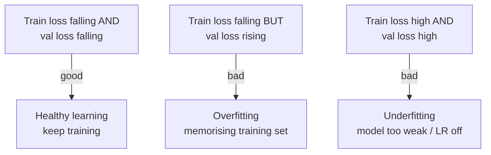

# 05 — Evaluation and Overfitting

> Training loss going down feels like success — but it can be a trap. A network can drive its *training* loss to nearly zero by **memorising** the training galaxies while getting *worse* at classifying ones it has never seen. This page is about telling real learning from memorising: how to evaluate a model honestly with `model.eval()` and `torch.no_grad()`, how to track **validation** loss alongside training loss, and how to read the gap between them to spot **overfitting**.

---

## Why We Held Out a Validation Set

Back in Week 1 we split the data 70 / 15 / 15 into **train**, **validation**, and **test**. Here's the discipline that split enforces:

| Split | Used for | The model "sees" it... |
|---|---|---|
| **Train** | Computing gradients and updating weights. | ...constantly, and learns from it. |
| **Validation** | Checking generalisation *during* development; tuning choices (epochs, LR, model size). | ...only to be *measured*, never to update weights. |
| **Test** | The **final**, one-time honest score. | ...once, at the very end. |

The validation set is your early-warning system. Because the model never trains on it, validation performance is a fair proxy for "how will this do on new galaxies?". If training loss falls but validation loss starts *rising*, you're memorising — stop.

> **The cardinal rule: never let the test set influence a decision.** Peek at it repeatedly and tune against it, and it quietly becomes a second training set — your final number will be a lie. Develop against validation; touch test once.

---

## Two Switches Every Evaluation Needs

Evaluating is *not* just "run the model without the backward pass". Two PyTorch settings must change, and forgetting either causes classic bugs.

### 1. `model.eval()` — switch to evaluation mode

```python
model.eval()    # evaluation/inference mode
# ... evaluate ...
model.train()   # remember to switch back before more training
```

Some layers behave **differently** in training vs evaluation. `Dropout` randomly zeroes activations during training (for regularisation) but must be *off* at eval. `BatchNorm` uses batch statistics while training but running averages at eval. Our basic `GalaxyCNN` has neither, so `eval()` changes nothing *yet* — but the moment you add them (stretch goals), forgetting `eval()` makes your accuracy random and irreproducible. Build the habit now.

### 2. `torch.no_grad()` — stop tracking gradients

```python
with torch.no_grad():
    for inputs, labels in val_loader:
        outputs = model(inputs.to(device))
        # ...
```

During training, PyTorch records every operation to build the computation graph for `backward()`. At evaluation we never call `backward()`, so that bookkeeping is pure waste — it **uses extra memory and time**. Wrapping the eval loop in `with torch.no_grad():` tells autograd "don't track anything here". It makes evaluation faster and lighter, and is essential to avoid `CUDA out of memory` on larger models.

> **`eval()` vs `no_grad()` are unrelated jobs.** `model.eval()` changes layer *behaviour* (dropout/batchnorm); `torch.no_grad()` changes gradient *tracking*. You need **both** to evaluate correctly and efficiently. They are not interchangeable.

---

## An Evaluation Function

A reusable helper that returns average loss **and** accuracy on any loader — we'll call it on both validation and test:

```python
@torch.no_grad()                                   # same as wrapping the body in torch.no_grad()
def evaluate(model, loader, criterion, device):
    model.eval()                                   # evaluation mode
    total_loss, correct, total = 0.0, 0, 0
    for inputs, labels in loader:
        inputs, labels = inputs.to(device), labels.to(device)
        outputs = model(inputs)                    # logits (B, num_classes)
        loss = criterion(outputs, labels)
        total_loss += loss.item() * inputs.size(0)

        preds = outputs.argmax(dim=1)              # predicted class = biggest logit
        correct += (preds == labels).sum().item()
        total += labels.size(0)

    avg_loss = total_loss / total
    accuracy = correct / total
    return avg_loss, accuracy
```

Two ideas to lock in:

- **`outputs.argmax(dim=1)`** turns logits into a predicted class index per sample — the position of the largest score. We don't need softmax for this; the biggest logit is the biggest probability.
- **Accuracy = correct / total.** `(preds == labels)` is a boolean tensor; `.sum().item()` counts the `True`s. Simple, and the headline number you'll report.

---

## Tracking Train vs Validation Over Time

The single most useful diagnostic is to record **both** losses each epoch and plot them together. Fold validation into the training loop from page 03:

```python
train_losses, val_losses, val_accs = [], [], []

for epoch in range(num_epochs):
    model.train()
    running = 0.0
    for inputs, labels in train_loader:
        inputs, labels = inputs.to(device), labels.to(device)
        optimizer.zero_grad()
        outputs = model(inputs)
        loss = criterion(outputs, labels)
        loss.backward()
        optimizer.step()
        running += loss.item() * inputs.size(0)
    train_loss = running / len(train_loader.dataset)

    val_loss, val_acc = evaluate(model, val_loader, criterion, device)  # eval()+no_grad() inside

    train_losses.append(train_loss)
    val_losses.append(val_loss)
    val_accs.append(val_acc)
    print(f"Epoch {epoch+1:2d}  train {train_loss:.3f}  val {val_loss:.3f}  val_acc {val_acc:.3f}")
```

Then plot:

```python
import matplotlib.pyplot as plt
plt.plot(train_losses, label="train")
plt.plot(val_losses, label="val")
plt.xlabel("epoch"); plt.ylabel("loss"); plt.legend(); plt.title("Loss curves")
plt.show()
```

---

## Reading the Curves: The Overfitting Signature

**Overfitting** is when the model learns the training set's noise and specifics instead of generalisable structure. Its signature in the curves is unmistakable: **training loss keeps falling while validation loss flattens and then turns upward**. The growing gap between the two lines *is* the overfitting.

```
loss
 │＼                         <- both fall early: genuine learning
 │  ＼____ train             <- train keeps falling
 │   ╲    ⌣‾‾＼___ val        <- val bottoms out, then rises = OVERFITTING
 │    ╲__/        ‾‾‾
 │
 └────────────────────────► epoch
                ↑
        best model is HERE (lowest val loss)
```



Text fallback: if train and val loss both fall, the model is learning healthily — keep going. If train loss falls but val loss rises, the model is overfitting (memorising). If both stay high, the model is underfitting (too small, or learning rate wrong).

| Pattern | Diagnosis | What to do |
|---|---|---|
| Train ↓, val ↓ together | Healthy. | Keep training until val flattens. |
| Train ↓, val ↑ (gap grows) | **Overfitting.** | Stop earlier; add augmentation; shrink model; add dropout; get more data. |
| Train high, val high | **Underfitting.** | Bigger model; train longer; check LR; verify data is correct. |
| Both jump around wildly | LR too high / batch too small. | Lower LR; increase batch size. |

### Levers against overfitting (in rough order of bang-for-buck)

1. **More data.** The most reliable fix. In Week 1 you set `PER_CLASS`; raising it gives the model more to generalise from.
2. **Data augmentation.** Random flips/rotations (Week 1 stretch goal). Galaxies have no preferred orientation, so this is almost free signal and *very* effective here.
3. **Early stopping.** Just stop at the epoch with the lowest validation loss — that's the best-generalising model. (Page 07 shows how to save it.)
4. **A smaller model / fewer epochs.** Less capacity to memorise.
5. **Dropout** (`nn.Dropout(0.3)` in the head). Randomly drops activations during training to discourage co-adaptation — and now `model.eval()` *really* matters.

> **Augmentation is special for galaxies.** A galaxy rotated 90° or mirrored is still the same kind of galaxy, so `RandomHorizontalFlip` and `RandomRotation` create genuinely valid new training examples. This is exactly the insight behind the rotation-invariant CNN that won the Kaggle Galaxy Zoo challenge ([Dieleman et al. 2015](https://arxiv.org/abs/1503.07077)).

---

## The Final Test-Set Score

Once you've used validation to pick your epochs/model and you're done tuning, evaluate **once** on the test set:

```python
test_loss, test_acc = evaluate(model, test_loader, criterion, device)
print(f"FINAL test accuracy: {test_acc:.3f}")
```

This is the number you report and compare to the Week-2 baseline. Compute it last, look at it once, and don't go back and tune against it.

---

## Common Pitfalls

| Symptom | Cause | Fix |
|---|---|---|
| Accuracy fluctuates run-to-run at eval | Forgot `model.eval()` (dropout/BN still active). | Call `model.eval()` before evaluating; `model.train()` after. |
| `CUDA out of memory` during evaluation | Forgot `torch.no_grad()`; graph stored for every batch. | Wrap the eval loop in `with torch.no_grad():`. |
| Suspiciously high accuracy (>0.98) | Evaluating on the training set, or test leaked into train. | Audit splits; evaluate on a clean held-out loader. |
| Validation loss lower than training loss every epoch | Often dropout (active in train, off in eval) — usually fine. | Confirm the trend; it's commonly benign. |
| Reported "best" number keeps improving as you tune | Tuning against the **test** set. | Tune on **validation**; touch test once at the end. |
| `argmax` predictions all one class | Model barely trained, or class imbalance. | Train longer; check class counts; ensure balanced sampling. |

---

## Quick Self-Check

1. Why do we evaluate on a validation set the model never trains on?
2. What does `model.eval()` change, and what does `torch.no_grad()` change? Why do you need both?
3. From logits, how do you get the predicted class and then the accuracy?
4. Describe the loss-curve signature of overfitting in one sentence.
5. Name three ways to fight overfitting, and say which is especially natural for galaxy images.

<details>
<summary>Answers</summary>

1. Because the model learns from (and can memorise) the training set, so training performance overstates how well it generalises; the held-out validation set, never used for weight updates, gives an honest estimate of performance on unseen galaxies.
2. `model.eval()` switches layers like `Dropout`/`BatchNorm` into inference behaviour; `torch.no_grad()` stops autograd from tracking operations (saving memory/time). They do different jobs — correct behaviour *and* efficiency — so you need both.
3. `preds = outputs.argmax(dim=1)` (index of the largest logit per sample), then `accuracy = (preds == labels).float().mean()` (or count correct ÷ total).
4. Training loss keeps decreasing while validation loss flattens then rises, so the gap between them widens.
5. More data, data augmentation (flips/rotations), early stopping, smaller model, dropout — any three. Augmentation by flips/rotations is especially natural because galaxies have no preferred orientation, so a rotated/mirrored galaxy is still a valid example of the same class.

</details>

---

## External Resources

- 📘 [PyTorch — `torch.no_grad` docs](https://docs.pytorch.org/docs/stable/generated/torch.no_grad.html) and [`nn.Module.eval`](https://docs.pytorch.org/docs/stable/generated/torch.nn.Module.html#torch.nn.Module.eval).
- 📘 [PyTorch — Optimization tutorial (train/test loops)](https://docs.pytorch.org/tutorials/beginner/basics/optimization_tutorial.html).
- 📘 [Google ML Crash Course — Overfitting and generalisation](https://developers.google.com/machine-learning/crash-course/overfitting/overfitting).
- 📺 [StatQuest — Bias and Variance / overfitting](https://www.youtube.com/watch?v=EuBBz3bI-aA).
- 📘 [CS231n — training and validation, regularisation](https://cs231n.github.io/neural-networks-3/).
- 📄 [Dieleman et al. 2015 — rotation-invariant CNNs (arXiv)](https://arxiv.org/abs/1503.07077) — augmentation done right for galaxies.

---

⬅️ Previous: [`04-spiral-structure-and-star-formation.md`](04-spiral-structure-and-star-formation.md) | ➡️ Next: [`06-confusion-matrix-and-metrics.md`](06-confusion-matrix-and-metrics.md)
