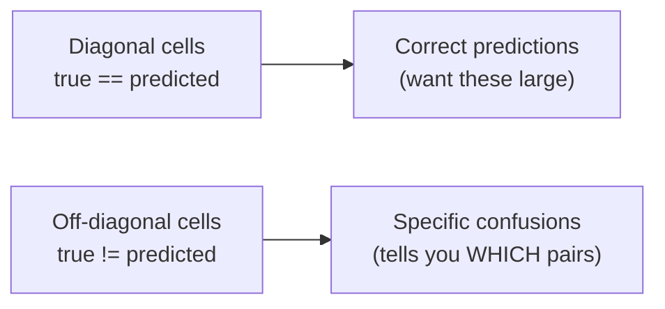

# 06 — The Confusion Matrix and Metrics

> A single accuracy number — "82%" — tells you *how often* the model is right, but not *where* it goes wrong. Does it nail ellipticals and fumble barred spirals? Does it confuse exactly the two classes an astronomer would? The **confusion matrix** answers that. It is the most informative single plot you can make about a classifier, and for this project it doubles as an astrophysics diagnostic.

---

## Why Accuracy Alone Lies

Imagine a 3-class problem where 80% of your galaxies are spirals. A lazy model that predicts "spiral" for *everything* scores **80% accuracy** while being completely useless — it never identifies a single elliptical or barred spiral. Accuracy hides this because it averages over classes weighted by how common they are.

You need **per-class** insight: how the model does on *each* type, and crucially, *which* wrong class it picks when it errs. That's the confusion matrix.

> This is the same worry as the **majority-class baseline** from Week 2: a high number can be hollow. The confusion matrix is how you check whether your CNN actually learned to *separate* the classes or just learned the class frequencies.

---

## What a Confusion Matrix Is

A confusion matrix is a square grid. **Rows = true class; columns = predicted class.** Cell `(i, j)` holds the count of samples whose true class is `i` but which the model predicted as `j`.

```
                      PREDICTED
                ellip   spiral   spiral_barred
        ellip  [  45  |    3   |     2       ]   <- 50 true ellipticals
TRUE   spiral  [   4  |   38   |     8       ]   <- 50 true spirals
spiral_barred  [   3  |   11   |    36       ]   <- 50 true barred spirals
                  ▲        diagonal = correct ▲
```

Read it like this:

- **The diagonal** (`(0,0)`, `(1,1)`, `(2,2)`) is **correct** predictions — true class equals predicted class. A good model has a bright, heavy diagonal.
- **Off-diagonal** cells are **mistakes**, and they're labelled: cell (row `spiral_barred`, col `spiral`) = 11 means *"11 truly barred spirals were called plain spirals"*. That single number is far more useful than "82% overall".
- **Each row sums to the number of true examples of that class** (here 50 each, because we balanced the data). So you can read a row as "of the 50 real barred spirals, 36 right, 11 called spiral, 3 called elliptical".



Text fallback: diagonal cells are correct predictions (you want them large); off-diagonal cells are mistakes and they tell you exactly which class got confused for which other class.

---

## Building One in PyTorch + scikit-learn

You already have an evaluation loop (page 05). To build a confusion matrix, just **collect every prediction and every true label** across the test set, then hand the two lists to scikit-learn.

```python
import torch
from sklearn.metrics import confusion_matrix, ConfusionMatrixDisplay, classification_report
import matplotlib.pyplot as plt

@torch.no_grad()
def collect_predictions(model, loader, device):
    model.eval()
    all_preds, all_labels = [], []
    for inputs, labels in loader:
        outputs = model(inputs.to(device))
        preds = outputs.argmax(dim=1).cpu()        # back to CPU for numpy/sklearn
        all_preds.append(preds)
        all_labels.append(labels)
    return torch.cat(all_preds).numpy(), torch.cat(all_labels).numpy()

y_pred, y_true = collect_predictions(model, test_loader, device)

cm = confusion_matrix(y_true, y_pred)
print(cm)

disp = ConfusionMatrixDisplay(confusion_matrix=cm, display_labels=test_ds.classes)
disp.plot(cmap="Blues", xticks_rotation=45)
plt.title("Galaxy CNN — confusion matrix (test set)")
plt.show()
```

Two details that bite beginners:

- **`.cpu()` before NumPy.** scikit-learn works with NumPy on the CPU; calling `.numpy()` on a CUDA tensor raises `TypeError: can't convert cuda:0 device type tensor to numpy`. Move predictions to the CPU first.
- **`display_labels=test_ds.classes`** uses the real class names (alphabetical, from `ImageFolder`) so the axes read `elliptical / spiral / spiral_barred` instead of `0 / 1 / 2`. Always label your axes — an unlabelled confusion matrix is a puzzle, not a diagnostic.

---

## Per-Class Metrics: Precision and Recall

The confusion matrix also gives you two metrics that pull apart the two *ways* a class can be wrong. For a given class:

- **Recall** (a.k.a. completeness) = of all the *true* members of this class, what fraction did we catch? `= diagonal / row sum`. Low recall means we **miss** that class.
- **Precision** (a.k.a. purity) = of everything we *labelled* as this class, what fraction was right? `= diagonal / column sum`. Low precision means we **over-call** that class (false alarms).

```
Recall(barred)    = 36 / (3+11+36) = 36/50 = 0.72   "we found 72% of real barred spirals"
Precision(barred) = 36 / (2+8+36)  = 36/46 = 0.78   "78% of our 'barred' calls were correct"
```

Astronomers care about this distinction constantly: a survey wanting a **pure** sample of mergers optimises precision; one wanting a **complete** census optimises recall. `classification_report` prints both per class, plus the **F1 score** (their harmonic mean):

```python
print(classification_report(y_true, y_pred, target_names=test_ds.classes))
```

| Metric | Question it answers | Hurt by |
|---|---|---|
| Accuracy | Overall, how often right? | Class imbalance hides per-class failure |
| Recall (per class) | Did we catch the real ones? | Missing that class (false negatives) |
| Precision (per class) | Were our calls for that class correct? | Over-calling that class (false positives) |
| F1 (per class) | Balance of precision & recall | Either being low |

---

## Turning Cells Into Actions

The whole point is that *specific* confusions suggest *specific* fixes. Reading our example matrix:

| Observation in the matrix | Likely cause | Concrete next step |
|---|---|---|
| `spiral_barred` ↔ `spiral` confused both ways (11 and 8) | The bar is a subtle feature; faint/edge-on bars look like plain spirals. | More data for barred class; augmentation; higher resolution than 64×64; a deeper model. |
| `elliptical` mostly correct, rarely confused | Smooth blob is visually distinct. | Probably fine; don't over-invest here. |
| A whole row is empty on the diagonal | Model never predicts that class. | Check class balance; the model may be ignoring a rare class. |
| Errors spread evenly everywhere | Model barely trained / underfitting. | Train longer; bigger model; revisit LR. |

> **Foreshadowing pages 07–08.** The barred-vs-unbarred and (if you add it) the *lenticular* row are where confusion concentrates — and that's **not just a modelling failure**. Lenticulars genuinely sit between ellipticals and spirals (page 08), and a faint bar genuinely resembles no bar (page 04). When the matrix confuses the classes astronomers also find ambiguous, the model is, in a sense, *right about being uncertain*. Interpreting that is the deliverable.

---

## Normalising for Readability

With balanced classes raw counts are fine. With imbalance, **normalise each row** so cells become *fractions of the true class* — easier to compare across classes of different sizes:

```python
cm_norm = confusion_matrix(y_true, y_pred, normalize="true")   # rows sum to 1.0
ConfusionMatrixDisplay(cm_norm, display_labels=test_ds.classes).plot(cmap="Blues")
```

Now the diagonal reads directly as **per-class recall** (e.g. `0.72` for barred spirals), and you can eyeball which class the model handles worst regardless of how many examples it had.

---

## Common Pitfalls

| Symptom | Cause | Fix |
|---|---|---|
| `TypeError: can't convert cuda:0 tensor to numpy` | Passed a GPU tensor to sklearn. | `.cpu()` predictions/labels before `.numpy()`. |
| Axes labelled `0,1,2`, unreadable | Didn't pass `display_labels`. | `display_labels=test_ds.classes`. |
| Matrix looks transposed / rows≠classes | Swapped `y_true` and `y_pred` argument order. | `confusion_matrix(y_true, y_pred)` — truth first. |
| Diagonal looks weak despite "good" accuracy | Accuracy inflated by one common class. | Read per-class recall; normalise rows. |
| Predictions all one class | Severe imbalance or undertrained model. | Balance classes; train longer; check the loss actually fell. |
| Confusion matrix from the **training** set looks perfect | Evaluating on data the model memorised. | Build it from the **test** loader. |

---

## Quick Self-Check

1. In a confusion matrix, what do the rows, columns, and diagonal represent?
2. Why can a high overall accuracy still hide a useless model?
3. Cell (true=`spiral_barred`, pred=`spiral`) = 11. State exactly what that means.
4. Define precision and recall for a class in terms of confusion-matrix cells.
5. Your matrix confuses barred and unbarred spirals heavily. Give one modelling fix and one astrophysical reason the confusion is expected.

<details>
<summary>Answers</summary>

1. Rows = true class, columns = predicted class; the diagonal holds correctly-classified counts (true class equals predicted class).
2. Accuracy averages over classes weighted by frequency, so a model that always predicts the majority class can score high while never correctly identifying the minority classes.
3. Eleven galaxies whose **true** class is barred spiral were **predicted** by the model to be (unbarred) spirals.
4. For a class, **recall** = diagonal ÷ row sum (fraction of true members caught); **precision** = diagonal ÷ column sum (fraction of predicted members that were correct).
5. Modelling fix: more barred-class data / augmentation / higher resolution / a deeper model. Astrophysical reason: a bar can be faint or foreshortened (edge-on), so a barred spiral genuinely resembles an unbarred one — the classes lie on a continuum.

</details>

---

## External Resources

- 📘 [scikit-learn — `confusion_matrix`](https://scikit-learn.org/stable/modules/generated/sklearn.metrics.confusion_matrix.html) and [`ConfusionMatrixDisplay`](https://scikit-learn.org/stable/modules/generated/sklearn.metrics.ConfusionMatrixDisplay.html).
- 📘 [scikit-learn — `classification_report`](https://scikit-learn.org/stable/modules/generated/sklearn.metrics.classification_report.html) (precision/recall/F1 per class).
- 📘 [scikit-learn — Model evaluation guide](https://scikit-learn.org/stable/modules/model_evaluation.html).
- 📺 [StatQuest — The Confusion Matrix clearly explained](https://www.youtube.com/watch?v=Kdsp6soqA7o).
- 📺 [StatQuest — Precision and Recall](https://www.youtube.com/watch?v=4jRBRDbJemM).
- 📘 [Google ML Crash Course — Classification metrics](https://developers.google.com/machine-learning/crash-course/classification/accuracy-precision-recall).
- 📘 [Wikipedia — Confusion matrix](https://en.wikipedia.org/wiki/Confusion_matrix) and [Precision and recall](https://en.wikipedia.org/wiki/Precision_and_recall).

---

⬅️ Previous: [`05-evaluation-and-overfitting.md`](05-evaluation-and-overfitting.md) | ➡️ Next: [`07-saving-and-loading-models.md`](07-saving-and-loading-models.md)
