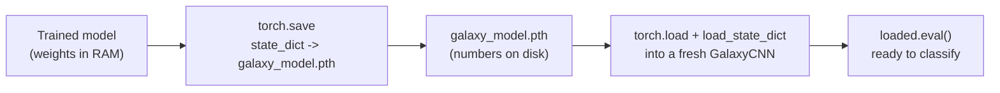

# 07 — Saving and Loading Models

> You just spent minutes (and electricity) training a CNN. Close the Colab tab without saving and it's gone — the weights live only in RAM. This page is the small, unglamorous, *essential* skill of **persistence**: writing trained weights to a file (`galaxy_model.pth`), loading them back into a fresh model, and confirming the reloaded model behaves identically. It's also the final deliverable of Week 3.

---

## What Exactly Are We Saving?

A trained model is two separate things:

1. **The architecture** — the Python code defining `GalaxyCNN` (its layers and `forward`). This lives in your source/notebook.
2. **The learned parameters** — the actual numbers in every weight and bias, the thing training produced. These live in the model's **`state_dict`**.

The `state_dict` is just an ordered dictionary mapping each layer's name to its parameter tensor:

```python
for name, tensor in model.state_dict().items():
    print(name, tuple(tensor.shape))
# features.0.weight (16, 3, 3, 3)
# features.0.bias   (16,)
# features.3.weight (32, 16, 3, 3)
# ...
# classifier.1.weight (128, 8192)
# classifier.3.weight (3, 128)
```

We save the **`state_dict`**, not the whole model object. That's the recommended PyTorch approach — portable, robust to code refactors, and not tied to the exact file paths your class was defined in.

---

## Saving: `torch.save(model.state_dict(), ...)`

```python
torch.save(model.state_dict(), "galaxy_model.pth")
print("Saved weights to galaxy_model.pth")
```

That writes one file containing every weight. The `.pth` (or `.pt`) extension is convention. The file is typically a few MB for our small CNN — tiny, because we only store numbers, not code.

> **Save the `state_dict`, not the model.** You *can* `torch.save(model, ...)` to pickle the whole object, but that brittle-ly couples the file to your exact class definition and import paths; loading it elsewhere often breaks. The community-standard, forward-compatible pattern is to save `model.state_dict()`. Use it.

### On Colab: save somewhere that survives

Colab's local disk is **wiped when the runtime recycles**. To keep weights, write them to mounted Google Drive:

```python
from google.colab import drive
drive.mount("/content/drive")
torch.save(model.state_dict(), "/content/drive/MyDrive/galaxy_model.pth")
```

Otherwise download the file via the Files panel, or push it to your fork (small models only — don't commit large binaries to this teaching repo; see the project task).

---

## Loading: rebuild, then `load_state_dict`

Loading is always **two steps**: first construct a model with the *same architecture*, then pour the saved numbers into it.

```python
# 1. Re-create the SAME architecture (same class, same num_classes)
loaded = GalaxyCNN(num_classes=num_classes).to(device)

# 2. Load the saved parameters into it
state = torch.load("galaxy_model.pth", map_location=device)
loaded.load_state_dict(state)

loaded.eval()    # set to eval mode for inference
```

Why each piece:

- **You must instantiate `GalaxyCNN` first.** The `state_dict` is just numbers; it has no idea what shape model they belong to. The architecture must match what was saved, or `load_state_dict` raises a size-mismatch error (a useful guard against loading the wrong file).
- **`map_location=device`** loads tensors onto the right device. It rescues the common case of weights saved on a GPU and reloaded on a CPU-only machine (`map_location="cpu"`), which otherwise errors.
- **`loaded.eval()`** — you're loading to *use* the model, which means inference, which means evaluation mode (page 05). Make it a reflex.



Text fallback: save the trained model's `state_dict` to `galaxy_model.pth`; later, build a fresh `GalaxyCNN` of the same architecture, `torch.load` the file and `load_state_dict` into it, then call `.eval()` to use it.

---

## The Reload Sanity Check

Never *assume* the round-trip worked — prove it. Evaluate the reloaded model and confirm it matches the original's accuracy exactly (page 05's `evaluate`):

```python
orig_loss, orig_acc   = evaluate(model,  test_loader, criterion, device)
load_loss, load_acc   = evaluate(loaded, test_loader, criterion, device)
print(f"original test acc: {orig_acc:.4f}")
print(f"reloaded test acc: {load_acc:.4f}")
assert abs(orig_acc - load_acc) < 1e-6, "Reloaded model differs — check architecture/state_dict match!"
print("Round-trip verified: weights saved and restored correctly.")
```

Identical accuracy (to floating-point precision) means the save/load round-trip is faithful. This one cell is the difference between "I think I saved it" and "I *know* I can ship it".

---

## Checkpoints: Saving More Than Just Weights

For longer training you often want to **resume** — which needs more than the weights. A **checkpoint** is a dictionary bundling everything needed to continue: model weights, optimiser state, the epoch number, and your loss history.

```python
checkpoint = {
    "epoch": epoch,
    "model_state": model.state_dict(),
    "optimizer_state": optimizer.state_dict(),   # Adam's momentum buffers, etc.
    "train_losses": train_losses,
    "val_losses": val_losses,
}
torch.save(checkpoint, "galaxy_checkpoint.pth")
```

Restore it:

```python
ckpt = torch.load("galaxy_checkpoint.pth", map_location=device)
model.load_state_dict(ckpt["model_state"])
optimizer.load_state_dict(ckpt["optimizer_state"])
start_epoch = ckpt["epoch"] + 1     # resume from here
```

> **Why save the optimiser too?** `Adam` keeps per-parameter running averages (momentum, variance). Drop those and resumed training restarts Adam cold, causing a visible loss "bump". For a 5–10 epoch project this rarely matters, but it's the right habit for real runs.

### Saving the *best* model (early stopping in practice)

Combine this with the overfitting story from page 05: track the best validation loss and overwrite the saved weights only when validation improves. You end the run with the *best-generalising* model on disk, not merely the last one.

```python
best_val = float("inf")
for epoch in range(num_epochs):
    # ... train one epoch ...
    val_loss, val_acc = evaluate(model, val_loader, criterion, device)
    if val_loss < best_val:
        best_val = val_loss
        torch.save(model.state_dict(), "galaxy_model_best.pth")   # keep only the best
        print(f"  ↳ new best (val_loss {val_loss:.3f}) — saved")
```

---

## `state_dict` vs checkpoint — which to use

| You want to... | Save | Load into |
|---|---|---|
| Ship a trained model for inference (the Week-3 deliverable) | `model.state_dict()` → `galaxy_model.pth` | a fresh `GalaxyCNN`, then `.eval()` |
| Pause and resume training later | a checkpoint dict (model + optimiser + epoch) | both `model` and `optimizer` |
| Keep the single best model during a run | `state_dict()` only when val improves | a fresh `GalaxyCNN` |

For this week's deliverable, the first row is all you strictly need: `torch.save(model.state_dict(), "galaxy_model.pth")`.

---

## Common Pitfalls

| Symptom | Cause | Fix |
|---|---|---|
| `Error(s) in loading state_dict: size mismatch` | Architecture differs from the saved one (e.g. different `num_classes` or channels). | Instantiate the **exact** same `GalaxyCNN` before loading. |
| `RuntimeError: ... CUDA ... CPU` on load | Weights saved on GPU, loaded on CPU (or vice versa). | Pass `map_location=device` (or `"cpu"`) to `torch.load`. |
| Reloaded model gives different/garbage predictions | Forgot `model.eval()`, or loaded the wrong file. | Call `.eval()`; verify the file path; run the sanity check. |
| Weights vanish after a break | Saved to Colab local disk, runtime recycled. | Save to mounted Google Drive or download the file. |
| `load_state_dict` "succeeds" but accuracy is random | Never actually trained, or saved before training finished. | Save *after* the training loop; run the round-trip assert. |
| `FutureWarning` about `weights_only` on `torch.load` | Newer PyTorch defaults. | For your own `state_dict` files, `torch.load(path, map_location=device)` is fine; only load files you trust. |

---

## Quick Self-Check

1. What is a `state_dict`, and why do we save it rather than the whole model object?
2. What are the two steps to load a model from a `state_dict` file?
3. What does `map_location` do, and when do you need it?
4. Why should you call `model.eval()` right after loading for inference?
5. What does a checkpoint contain beyond the weights, and why save the optimiser state?

<details>
<summary>Answers</summary>

1. A `state_dict` is an ordered mapping from each layer's name to its parameter tensors (the learned numbers). We save it (not the pickled model) because it's portable and not coupled to the exact class definition/import paths, so it loads reliably elsewhere.
2. First instantiate a model with the **same architecture** (`GalaxyCNN(num_classes=...)`), then `model.load_state_dict(torch.load(path, map_location=device))`.
3. It remaps the saved tensors onto a target device while loading; you need it when the save device differs from the load device (e.g. GPU-saved weights loaded on CPU).
4. Because loading is for inference, and `eval()` disables training-only behaviour (dropout/batchnorm) so predictions are deterministic and correct.
5. A checkpoint adds the optimiser state, the epoch number, and loss history so training can **resume**. The optimiser state (Adam's momentum/variance buffers) is saved so resumed training doesn't restart the optimiser cold and cause a loss bump.

</details>

---

## External Resources

- 📘 [PyTorch — Saving and Loading Models (the definitive guide)](https://docs.pytorch.org/tutorials/beginner/saving_loading_models.html).
- 📘 [PyTorch — Save and load the model (basics tutorial)](https://docs.pytorch.org/tutorials/beginner/basics/saveloadrun_tutorial.html).
- 📘 [PyTorch — Saving and loading a general checkpoint](https://docs.pytorch.org/tutorials/recipes/recipes/saving_and_loading_a_general_checkpoint.html).
- 📘 [`torch.save`](https://docs.pytorch.org/docs/stable/generated/torch.save.html) and [`torch.load`](https://docs.pytorch.org/docs/stable/generated/torch.load.html) docs.
- 📘 [Google Colab — saving to Google Drive](https://colab.research.google.com/notebooks/io.ipynb).
- 📺 [Daniel Bourke — saving & loading PyTorch models](https://www.learnpytorch.io/01_pytorch_workflow/#5-saving-and-loading-a-pytorch-model).

---

⬅️ Previous: [`06-confusion-matrix-and-metrics.md`](06-confusion-matrix-and-metrics.md) | ➡️ Next: [`08-lenticulars-mergers-and-evolution.md`](08-lenticulars-mergers-and-evolution.md)
