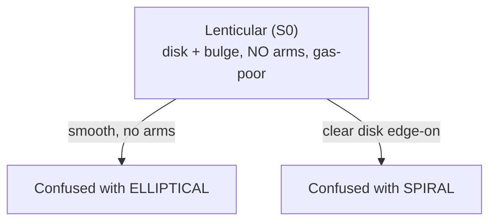
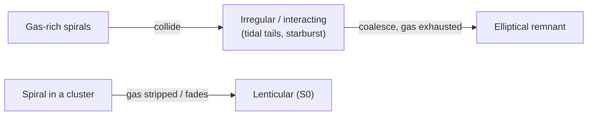

# 08 — Lenticulars, Mergers, and Galaxy Evolution

> Your confusion matrix (page 06) will show the model muddling certain galaxy types — and the worst offenders are almost never random. They're the genuinely ambiguous classes that confuse *human* experts too. This page explains the two biggest sources of that ambiguity: **lenticular (S0) galaxies**, the missing link between ellipticals and spirals, and **galaxy mergers**, which churn out the irregular shapes that defy tidy boxes. The deeper lesson: morphology is not fixed — it **evolves**.

> Images are **linked** from public NASA / ESA / NOIRLab / SDSS archives, not embedded.

---

## A Reminder: The Hubble Sequence Is Not a Ladder

Recall the Hubble tuning fork from [`../Week-1/04-hubble-tuning-fork.md`](../Week-1/04-hubble-tuning-fork.md): ellipticals on the handle, spirals (barred and unbarred) on the two prongs, and the **lenticular (S0)** sitting right at the fork — the hinge between them. Hubble drew it left-to-right and called the left "early-type" and the right "late-type". That naming is a **historical misnomer**: it does **not** mean ellipticals turn into spirals over time, or vice versa. It was a *classification* convenience, not an evolutionary claim.

We flag this again because this page is precisely about *real* evolution — and the whole point is that it does **not** follow the tuning fork's left-to-right arrow.

```
   "early-type"  ───────────────────────────►  "late-type"
   (historical names — NOT a time direction!)

        E0 ── E7 ── S0 ── Sa ── Sb ── Sc
        |          ↑↑↑                |
     ellipticals   the ambiguous     spirals
                   hinge (lenticular)
```

---

## Lenticular (S0) Galaxies: The Great In-Between

A **lenticular** galaxy has the parts of both families and the signature of neither:

- It has a **disk** — like a spiral.
- It has a prominent central **bulge** — often large, like an elliptical.
- It has **no spiral arms** — unlike a spiral.
- It has **little cold gas** and **little ongoing star formation** — like an elliptical ("red and dead").

So a lenticular is, roughly, "a disk galaxy that has stopped forming stars and lost (or used up) its arm-defining gas." Visually it's a smooth, lens-shaped disk with a bright centre — and that's exactly why it's so hard to classify.

| Seen face-on | Looks like... | Because... |
|---|---|---|
| Smooth disk, no arms, bright bulge | an **elliptical** | no arms or colour to distinguish it |
| Edge-on lens with a central bulge | a **spiral** seen edge-on | the disk is obvious but you can't see the (absent) arms |



Text fallback: a lenticular has a disk and bulge but no arms and little gas; face-on it can be mistaken for an elliptical (smooth, no arms), and edge-on its obvious disk can be mistaken for a spiral — so it straddles both neighbouring classes.

> **Why your CNN will struggle with S0 (if you include it).** A lenticular shares its *smoothness* with ellipticals and its *disk* with spirals. The discriminating cue — "disk but definitely no arms, and not gas-blue" — is exactly the kind of subtle, global judgement that even experienced Galaxy Zoo volunteers disagree on. Expect the lenticular row/column of the confusion matrix to be the messiest. That mess is **honest**: the classes really do overlap. (Our default 3-class setup from Week 1 folds these tendencies into `elliptical`/`spiral`; if you add an S0 class as a stretch goal, watch the confusions appear.)

How do lenticulars form? Likely several routes: a spiral that **used up or was stripped of its gas** (e.g. falling into a galaxy cluster, where ram-pressure strips the gas), or **faded** after its star formation shut down, or a **gentle merger** that puffed up the bulge without fully destroying the disk. All of these are *evolutionary* processes — morphology changing over cosmic time.

---

## Mergers: Where Irregulars Come From

Galaxies are not islands. They live in groups and clusters, pulled together by gravity, and over billions of years they **collide and merge**. A merger is the single most dramatic thing that can happen to a galaxy's morphology.

When two galaxies interact, tidal gravitational forces:

- **Distort** their shapes — drawing out long **tidal tails** and **bridges** of stars and gas.
- **Compress gas clouds**, triggering intense bursts of star formation — a **starburst** — that light the system up in blue knots (the same physics as spiral arms, page 04, but galaxy-wide).
- Eventually **coalesce** the two galaxies into one, often scrambling ordered disks into a pressure-supported blob.

The result, mid-merger, is an **irregular** galaxy: chaotic, asymmetric, lopsided, with no clean elliptical or spiral structure. The textbook example is the [Antennae Galaxies (ESA/Hubble)](https://esahubble.org/images/heic0812c/), two spirals mid-collision flinging out the long "antennae" tidal tails that name them.

```
Two spirals approach ─► tidal tails + starburst ─► merged remnant
   🌀     🌀              ✦ chaos, blue knots ✦        ⬤ (often elliptical-like)
   (ordered disks)        (IRREGULAR phase)            (settled, gas exhausted)
```

### The big-picture punchline

Run that forward and a startling idea emerges: **a major merger of two gas-rich spirals can produce an elliptical.** The collision destroys the disks, randomises stellar orbits into a spheroid, and the starburst burns through the gas — leaving a smooth, gas-poor, "red and dead" elliptical. This is a leading explanation for how many massive ellipticals formed.

So morphology is a **movie, not a snapshot**:



Text fallback: gas-rich spirals that collide pass through a chaotic irregular/interacting phase (tidal tails, starbursts) and can coalesce into an elliptical once the gas is exhausted; separately, a spiral that loses its gas (e.g. in a cluster) can fade into a lenticular. Morphology changes over time.

This is why the "early/late-type" names are so misleading: the actual evolutionary arrows can run *toward* the elliptical end, the opposite of the left-to-right reading.

---

## What This Means for Your Model

Tie it back to the deliverable. When you read your confusion matrix and per-class metrics (page 06), interpret them with this astrophysics in hand:

| Confusion you may see | The astrophysics behind it |
|---|---|
| Smooth spirals/S0 ↔ ellipticals | Lenticulars and bulge-dominated spirals genuinely look like ellipticals; the boundary is fuzzy. |
| Barred ↔ unbarred spirals | The bar is a subtle, sometimes faint or foreshortened feature (page 04). |
| Irregulars ↔ everything | Mergers are a *transient phase*; an irregular can be caught looking part-spiral, part-blob. |
| Edge-on spirals ↔ ellipticals/S0 | Orientation hides the arms; geometry, not type, drives the error. |

The model's mistakes, in other words, often trace **real physical continua and real projection effects** — not just insufficient training. A good Week-3 write-up doesn't just report "82% accuracy"; it points at the off-diagonal cells and says *why* those particular galaxies are hard, in the language of this page.

> **The honest takeaway.** Galaxy morphology is a human-imposed grid over a continuous, time-evolving reality. Our discrete labels (`elliptical`, `spiral`, `spiral_barred`) are a useful simplification, but nature doesn't draw the lines as sharply as our `ImageFolder` does. When your CNN hesitates exactly where astronomers hesitate, it has learned something true about the universe — including its ambiguities.

---

## Quick Self-Check

1. What three structural features define a lenticular (S0), and which one does it *lack* compared to a spiral?
2. Why is a lenticular easy to confuse with *both* ellipticals and spirals?
3. Why is "early-type / late-type" a misleading naming convention?
4. List two morphological signatures of an ongoing galaxy merger.
5. Explain how a merger of two spirals can end up producing an elliptical.

<details>
<summary>Answers</summary>

1. A lenticular has a **disk**, a central **bulge**, and (typically) **little gas / no ongoing star formation**; it **lacks spiral arms**, which a spiral has.
2. It shares its smooth, arm-less, gas-poor appearance with ellipticals, but it also has a clear disk like a spiral (obvious especially edge-on) — so depending on orientation it resembles either neighbour.
3. The terms come from Hubble's left-to-right diagram and sound temporal, but they do **not** describe an evolutionary sequence; ellipticals are not "young" galaxies that become spirals (or vice versa) — it's a classification convenience, not a time order.
4. Tidal tails/bridges (drawn-out streams of stars and gas), strong asymmetry/distortion, and starburst activity (bright blue star-forming knots) — any two.
5. The collision destroys both ordered disks and randomises stellar orbits into a spheroid, while the merger-driven starburst consumes the available cold gas; the gas-poor, smooth, pressure-supported remnant is an elliptical.

</details>

---

## External Resources

- 📘 [Wikipedia — Lenticular galaxy](https://en.wikipedia.org/wiki/Lenticular_galaxy) and [Galaxy merger](https://en.wikipedia.org/wiki/Galaxy_merger).
- 📘 [Wikipedia — Interacting galaxies](https://en.wikipedia.org/wiki/Interacting_galaxy) and [Galaxy morphological classification](https://en.wikipedia.org/wiki/Galaxy_morphological_classification).
- 🖼️ [ESA/Hubble — The Antennae Galaxies (a merger in progress)](https://esahubble.org/images/heic0812c/).
- 🖼️ [NASA — Hubble interacting galaxies gallery (Arp catalogue)](https://science.nasa.gov/mission/hubble/multimedia/).
- 🌌 [Galaxy Zoo](https://www.zooniverse.org/projects/zookeeper/galaxy-zoo/) — try classifying a few yourself and feel the ambiguity first-hand.
- 📺 [Dr. Becky — how galaxies merge and evolve](https://www.youtube.com/@DrBecky).
- 📄 [Toomre & Toomre 1972 — galaxy bridges and tails (ADS)](https://ui.adsabs.harvard.edu/abs/1972ApJ...178..623T/abstract) — the classic merger-simulation paper.
- 📘 *Galaxies in the Universe* — Sparke & Gallagher, chapters on galaxy interactions and evolution.

---

⬅️ Previous: [`07-saving-and-loading-models.md`](07-saving-and-loading-models.md) | ➡️ Next: [`09-project-task.md`](09-project-task.md)
