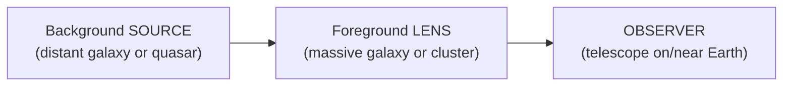

# 01 — Gravitational Lensing 101

> For three weeks we sorted galaxies by their *own* shape — spiral, elliptical, lenticular. This week we chase something stranger: galaxies whose images are warped by the gravity of *another* mass sitting in front of them. Einstein predicted it, telescopes confirmed it, and today these **gravitational lenses** are one of the sharpest tools we have for weighing dark matter and peering at the most distant galaxies. Before we ask a model to find them, we need to understand what they are.

---

## The One Idea: Mass Bends Light

Newton imagined light as tiny bullets flying in straight lines. Einstein's general relativity says something deeper: **mass curves spacetime**, and light simply follows the shortest path through that curved geometry. Near a heavy object, that "shortest path" is bent.

A useful (if imperfect) picture: roll a marble across a stretched rubber sheet. Place a bowling ball on the sheet and the marble's path curves toward it. Replace the bowling ball with a galaxy and the marble with a beam of light, and you have gravitational lensing.

```
   Distant galaxy (the source)
            *
           /|\        light leaves in all directions
          / | \
         /  |  \
        /   |   \
   ====[ FOREGROUND MASS ]====   <- its gravity bends the light
        \   |   /
         \  |  /
          \ | /
            v
          [ YOU ]                 <- you see the source shifted,
                                     stretched, or multiplied
```

The foreground mass — usually a massive galaxy or a whole galaxy cluster — acts like a lumpy, imperfect lens. It doesn't focus light to a clean point the way a glass lens does; instead it **stretches, brightens, and sometimes multiplies** the image of whatever sits behind it.

The first confirmation came in 1919, when Arthur Eddington measured starlight bending around the Sun during a total solar eclipse — the observation that made Einstein famous overnight. The first *galaxy-scale* lens (the "Twin Quasar" Q0957+561, one quasar that looks like two) was found in 1979.

---

## Three Ingredients Every Lens Needs

A gravitational lens is really an **alignment** of three things along your line of sight:



Text fallback: a distant background **source** sends out light; a massive foreground **lens** sits between it and us and bends that light; the **observer** sees the distorted result.

1. A **source** far in the background — often a faint, distant galaxy or quasar.
2. A **lens** — a concentration of mass (a galaxy or cluster) closer to us.
3. **Near-perfect alignment** of source, lens, and observer.

Because that triple alignment is rare, strong lenses are rare. Out of millions of galaxies in a survey, only a tiny fraction sit in front of a well-aligned background source. That rarity is the whole reason this week's machine-learning problem is hard — and interesting.

---

## Strong vs Weak Lensing (We Only Use Strong)

Lensing comes in two regimes, and the difference matters for what a model can even hope to see.

| | **Strong lensing** | **Weak lensing** |
|---|---|---|
| What you see | Dramatic, **visible** arcs, rings, or multiple images | Tiny, **invisible-by-eye** shape distortions |
| Alignment needed | Near-perfect | Loose; happens everywhere to some degree |
| Detection | Look at a single cutout | Average the shapes of **thousands** of galaxies statistically |
| In this track | **Yes — our entire focus** | No — out of scope for the notebooks |

**Strong lensing** is what makes the postcard images: complete Einstein rings, giant arcs draped around a cluster, a quasar split into four. You can point at a single image and say "that's a lens." This is exactly the kind of feature a vision model can be prompted to recognise.

**Weak lensing** is subtler. Every massive object distorts the shapes of background galaxies *a little* — squashing them by perhaps a percent. No single galaxy looks obviously lensed; the signal only emerges when you average the orientations of huge numbers of them. It is a cornerstone of cosmology (it maps dark matter across the whole sky), but it is a **statistical** measurement, not a per-image one, so we leave it aside here.

> **Why the distinction matters for ML.** Strong lensing is a *per-image* recognition task — perfect for a model that scores one cutout at a time. Weak lensing is a *population statistics* task that no amount of "does this one image look lensed?" prompting can solve. Knowing which regime you're in tells you whether your tool even fits the job — a theme we return to in Week 5.

---

## Why Astronomers Care

Lenses are not just pretty. They are physical instruments that do three jobs no other technique does as cleanly:

- **Weighing dark matter.** The amount of bending depends on the *total* mass of the lens — visible stars **plus** invisible dark matter. By measuring how much an image is distorted, astronomers weigh the lens directly, including the dark matter that emits no light. Lensing is one of the most direct ways we know dark matter is there.
- **A free cosmic zoom lens.** A lens **magnifies** the background source, making galaxies far too faint and distant to study otherwise suddenly observable. Some of the earliest galaxies ever seen were caught because a foreground cluster magnified them — a natural telescope bolted onto our own.
- **Measuring the expansion of the Universe.** In lenses that produce multiple images of a *variable* source (like a flickering quasar), light takes slightly different-length paths to each image, so a flicker arrives at different times. Those **time delays** can be turned into an independent measurement of the Hubble constant `H0` — the Universe's expansion rate.

Surveys like **Euclid** (whose cutouts we use this week), **Rubin/LSST**, and **HST/JWST** are expected to discover anywhere from thousands to *hundreds of thousands* of new lenses — far too many for humans to vet by eye. That scale is precisely why automated and AI-assisted lens finding (our Week 4 and Week 5 project) is an active research frontier.

---

## A Naming Trap: Lens ≠ Lenticular

This catches people every time, so let's kill it now.

| Term | What it is | Where it came from |
|---|---|---|
| Gravitational **lens** | An *optical effect*: a foreground mass bending the light of a background object. | This week. Physics of spacetime. |
| **Lenticular (S0)** galaxy | A *type of galaxy* — a disk with no spiral arms, between elliptical and spiral on the Hubble fork. | [Week 3](../Week-3/08-lenticulars-mergers-and-evolution.md). Morphology classification. |

They share the root "lens" (Latin for *lentil*, because both are lens-shaped or lens-related) but they are completely different concepts. A lenticular galaxy is a thing you classify by its shape; a gravitational lens is something happening to light passing a mass. A lenticular galaxy could, in principle, *act as* a gravitational lens — but the words name different ideas. Don't let the shared prefix fool you.

---

## What the Cutouts Look Like (Preview)

This week's dataset is a pile of small **Euclid** image cutouts, each one expert-graded as "looks like a strong lens" or "doesn't." Some hold textbook arcs and rings; most are ordinary galaxies and empty-ish sky. Our job in Part 2 is to get a vision–language model to rank them — pushing the rare lenses toward the top — without ever training it on a single labelled example.

Page [`02`](02-strong-lens-morphologies.md) catalogues exactly what those lens features look like (rings, arcs, doubles, quads, cluster lenses) so you know what you — and the model — are hunting for.

---

## Quick Self-Check

1. In one sentence, what physically causes gravitational lensing?
2. Name the three ingredients that must line up to produce a strong lens.
3. Give one observational difference between strong and weak lensing.
4. Why can't "does this single image look lensed?" prompting detect weak lensing?
5. What's the difference between a gravitational *lens* and a *lenticular* galaxy?

<details>
<summary>Answers</summary>

1. Mass curves spacetime, and light follows that curved geometry, so light passing a massive object is bent.
2. A distant background **source**, a massive foreground **lens**, and near-perfect **alignment** of source, lens, and observer along the line of sight.
3. Strong lensing produces dramatic features (arcs, rings, multiple images) visible in a single image; weak lensing produces tiny shape distortions only detectable by averaging thousands of galaxies statistically.
4. Weak lensing is a population-level statistical signal — no individual galaxy looks obviously lensed, so per-image recognition can't reveal it; you must average many galaxies' shapes.
5. A gravitational lens is an optical *effect* (a foreground mass bending background light); a lenticular (S0) is a *galaxy type* (a smooth disk with no spiral arms). Same prefix, unrelated physics.

</details>

---

## External Resources

- 📘 [NASA — Gravitational lensing (overview)](https://science.nasa.gov/mission/hubble/science/science-behind-the-discoveries/hubble-gravitational-lenses/).
- 📘 [ESA/Hubble — Gravitational lensing explainer](https://esahubble.org/wordbank/gravitational-lensing/).
- 📘 [Wikipedia — Gravitational lens](https://en.wikipedia.org/wiki/Gravitational_lens) and [Strong gravitational lensing](https://en.wikipedia.org/wiki/Strong_gravitational_lensing).
- 📺 [PBS Space Time — Gravitational lensing](https://www.youtube.com/watch?v=4Z71RtwoOas).
- 📘 [ESA Euclid — mission and lensing science](https://www.esa.int/Science_Exploration/Space_Science/Euclid).

---

➡️ Next: [`02-strong-lens-morphologies.md`](02-strong-lens-morphologies.md) | 📚 Week hub: [`README.md`](README.md)
