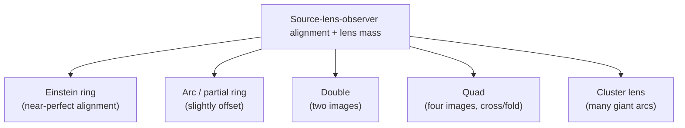

# 02 — Strong-Lens Morphologies

> Page 01 explained *why* light bends. This page is a field guide to *what the bending looks like*. Just as the Hubble Tuning Fork gave us a vocabulary for galaxy shapes in Week 1, strong lensing has its own small zoo of recognisable forms — rings, arcs, doubles, quads, and cluster-scale arcs. Learning to name them is exactly the visual literacy you'll need to (a) write good CLIP prompts in Part 2 and (b) judge whether the model's "lens!" calls are believable.

---

## What Sets the Shape: Alignment and Mass

The morphology of a lens — ring vs arc vs multiple points — is set by two things:

1. **How well the source, lens, and observer are aligned.** Perfect alignment → a full ring. Slightly off → arcs or multiple images.
2. **The mass distribution of the lens.** A single smooth galaxy lenses differently from a lumpy cluster of hundreds of galaxies.

A handy reference scale is the **Einstein radius** — the radius of the ring you'd get from a perfectly aligned, perfectly symmetric lens. Real lenses are never perfect, so instead of a clean ring you usually get pieces of one: arcs and points scattered near that radius. Keep that mental image — *"fragments of a ring at the Einstein radius"* — and every morphology below becomes a variation on a theme.

---

## The Five Forms You'll See

Text fallback: the degree of alignment and the lens's mass distribution decide which form appears — a full Einstein ring (near-perfect alignment), an arc or partial ring (slightly offset), a double (two images), a quad (four images), or a cluster lens (many giant arcs from a galaxy cluster).

### 1. Einstein ring

The showpiece. When the source sits almost exactly behind a symmetric lens, its light is bent equally all the way around, smearing it into a **complete or near-complete circle** of light surrounding the foreground galaxy. You see a bright central blob (the lens galaxy) wrapped in a thin glowing ring (the lensed background source). Famous examples include the "Molten Ring" and the Cosmic Horseshoe.

### 2. Arc (partial ring)

Far more common than a full ring. Imperfect alignment turns the ring into one or more **curved streaks** — arcs — hugging one side of the lens galaxy. An arc is, quite literally, a fragment of an Einstein ring. These are the bread-and-butter strong lenses in survey data, and also the ones most easily confused with spiral arms (more on that in [Week 5](../Week-5/)).

### 3. Double

When alignment is poor and the lens is a single galaxy, the source can appear as **two separate images** straddling the lens — one brighter, one fainter. The Twin Quasar (Q0957+561), the first lens ever found, is a double.

### 4. Quad (quadruple)

A particularly favourable geometry produces **four images** of one source, arranged in a cross or a tight fold around the lens. The "Einstein Cross" (a single quasar appearing as four points around a foreground galaxy) is the textbook case. Quads are prized because their four images strongly constrain the lens mass model and enable `H0` time-delay measurements.

### 5. Cluster lens (giant arcs)

Scale everything up. A whole **galaxy cluster** — hundreds of galaxies plus a vast dark-matter halo — is the most massive lens of all. Behind a cluster you see a chaotic, beautiful field of **multiple giant arcs**, often stretched into long thin curves, from many different background galaxies at once. These are the deep-field hero images from HST and JWST.

| Form | Alignment | Lens | What you see |
|---|---|---|---|
| Einstein ring | Near-perfect | Single galaxy | Full/near-full circle of light |
| Arc | Slightly offset | Single galaxy | One or more curved streaks |
| Double | Poor | Single galaxy | Two separated images |
| Quad | Favourable | Single galaxy | Four images (cross/fold) |
| Cluster lens | Varied | Galaxy cluster | Many giant arcs at once |

---

## What a Lens Is *Not* (Decoys to Know)

Half the skill in lens-finding is rejecting look-alikes. Several ordinary things mimic lens features, and they'll show up as **false positives** when CLIP scores your cutouts in Part 2:

- **Spiral arms.** A face-on spiral has curved, bright arms that superficially resemble arcs. The giveaway: spiral arms wind out from the galaxy's own centre, while a lensing arc is concentric *around a separate foreground galaxy*.
- **Tidal tails from mergers.** Interacting galaxies fling out long curved streams of stars (Week 3's Antennae). These curves can fool an eye — and a model — into seeing an arc.
- **Ring galaxies.** A head-on collision can punch a literal ring of star formation into a galaxy (e.g. Hoag's Object). It looks like an Einstein ring but is intrinsic structure, not lensing.
- **Edge-on disks and dust lanes.** A thin bright streak with a dark lane can mimic a straight arclet.

> **This is the central tension of the whole project.** The visual features that *define* a lens (curved, arc-like, ring-like brightness offset from a galaxy centre) are shared by several non-lens phenomena. A model that fires on "curved bright streak" will catch real arcs **and** spiral arms. We don't treat that as a failure to hide — in Part 2 and Week 5 we *study* it, because understanding the confusion is the scientific payoff.

---

## How Experts Grade Them (and Our Dataset)

Nobody confirms a lens from a single glance. Real surveys use a graded scale — roughly:

- **Grade A:** almost certainly a lens (clear arc/ring with the right geometry).
- **Grade B:** probably a lens, worth follow-up.
- **Grade C / non-lens:** unconvincing or clearly something else.

This week's dataset, [`mwalmsley/euclid_strong_lens_expert_judges`](https://huggingface.co/datasets/mwalmsley/euclid_strong_lens_expert_judges), distils human-expert grades into a binary label: `1` = "grade A or B lens," `0` = "not a grade-A/B lens." Two consequences to keep in mind:

- The labels reflect **expert judgement on pre-selected cutouts**, not a random sweep of the sky — so the class balance is unusual, and the negatives are often "hard" cases that already looked interesting enough to grade.
- Even experts disagree on borderline arcs. Some of the model's "mistakes" will be images that humans also argue about. That's not an excuse for the model — it's context for reading its errors honestly.

---

## A Gallery to Study (Linked, Not Committed)

Per this repo's no-binaries rule, study these on the source sites — they are the canonical examples worth burning into your visual memory:

- 🖼️ [ESA/Hubble — the "Molten Ring" (a near-complete Einstein ring)](https://esahubble.org/images/heic2003a/).
- 🖼️ [ESA/Hubble — the Cosmic Horseshoe (giant arc/ring)](https://esahubble.org/images/potw1151a/).
- 🖼️ [NASA — the Einstein Cross (a quad)](https://science.nasa.gov/image-detail/amf-gsfc-20171208-archive-e000543/).
- 🖼️ [ESA/Hubble — Abell 370 (cluster lens, many giant arcs)](https://esahubble.org/images/heic1711a/).
- 🖼️ [CASTLES survey — gallery of HST-imaged lens systems](https://lweb.cfa.harvard.edu/castles/).

Spend ten minutes here before the notebook. The better your mental template for "what a real arc looks like," the better the prompts you'll write — and the sharper your judgement of CLIP's output.

---

## Quick Self-Check

1. What single alignment condition produces a full Einstein ring rather than an arc?
2. An arc is best described as a fragment of what?
3. What is the difference between a "double" and a "quad" lens?
4. Why is a cluster lens able to show many giant arcs at once?
5. Name two non-lens phenomena that can masquerade as lensing arcs, and the tell-tale that distinguishes a real arc.

Answers

1. Near-perfect alignment of source, lens, and observer (with a fairly symmetric lens) bends the light equally all the way around into a ring.
2. A fragment of an Einstein ring — the same lensed light, but only part of the circle because alignment is imperfect.
3. A double shows the background source as **two** images straddling the lens; a quad shows **four** images (a cross or fold) from a more favourable geometry.
4. A cluster has enormous mass (hundreds of galaxies plus dark matter) acting on **many** different background galaxies simultaneously, so several are lensed into arcs at once.
5. Spiral arms and merger tidal tails (also ring galaxies, edge-on dust lanes). The tell-tale: a true lensing arc curves *concentrically around a separate foreground galaxy*, whereas spiral arms wind out from the galaxy's own centre.

---

## External Resources

- 📘 [CASTLES survey of gravitational lenses (CfA Harvard)](https://lweb.cfa.harvard.edu/castles/) — the classic HST lens gallery.
- 📘 [ESA/Hubble — gravitational lensing image archive](https://esahubble.org/images/archive/category/gravitationallensing/).
- 📘 [Wikipedia — Einstein ring](https://en.wikipedia.org/wiki/Einstein_ring) and [Einstein Cross](https://en.wikipedia.org/wiki/Einstein_Cross).
- 📺 [Dr. Becky — gravitational lensing and what it reveals](https://www.youtube.com/@DrBecky).
- 📘 [The Hugging Face card for `mwalmsley/euclid_strong_lens_expert_judges`](https://huggingface.co/datasets/mwalmsley/euclid_strong_lens_expert_judges) — read how the expert grades were assigned.

---

⬅️ Previous: [`01-gravitational-lensing-101.md`](01-gravitational-lensing-101.md) | ➡️ Next: [`03-vision-language-models-and-clip.md`](03-vision-language-models-and-clip.md) | 📚 Week hub: [`README.md`](README.md)
