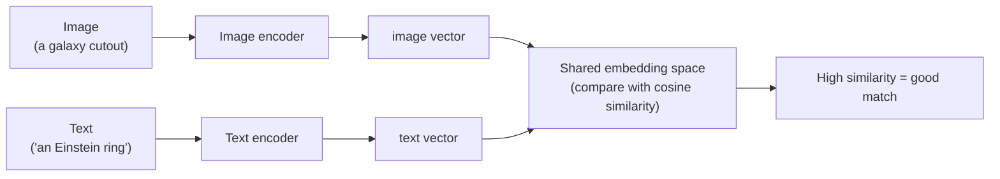

# 03 — Vision–Language Models and CLIP

> For three weeks every model we built had exactly one job, learned from labelled examples: "here are 5,000 spiral galaxies, learn what a spiral is." This page introduces a completely different kind of model — one that learned about images and words *together*, from the open internet, and can classify things it was **never explicitly trained to classify**. That model is **CLIP**, and it's the engine of this week's lens hunt. No training loop. No `galaxy_model.pth`. Just a pretrained brain and a few well-chosen sentences.

---

## What Is a Vision–Language Model?

A **vision–language model (VLM)** is a model that understands images and text *in the same breath* — it can relate a picture to a description and vice versa. That family includes CLIP (this week), and larger systems like LLaVA and GPT-4o that can actually *write* about an image (Week 5).

Contrast that with everything so far:

| | Week 3 CNN | Vision–language model (CLIP) |
|---|---|---|
| Trained on | Your labelled galaxy folders | ~400 million image–text pairs from the web |
| Knows about | The exact classes you gave it | A huge range of everyday and scientific concepts |
| To classify a new category | Retrain with new labelled data | Just **write a new text prompt** |
| Output | Fixed list of class logits | A similarity score between *any* image and *any* text |

The superpower is that last row. A CNN can only ever output the classes it was trained on. CLIP can compare an image to *any sentence you can type* — including `"a strong gravitational lens with an Einstein ring"`, a class it was never specifically taught.

---

## CLIP's Big Idea: One Shared Space for Pictures and Words

CLIP (Contrastive Language–Image Pre-training, from OpenAI in 2021) is built from **two encoders**:

- An **image encoder** (a vision transformer or CNN) that turns a picture into a vector — a list of numbers, called an **embedding**.
- A **text encoder** (a transformer) that turns a sentence into a vector of the *same length*.

The magic is that both encoders are trained so their vectors live in **one shared embedding space**. An image of a dog and the text `"a photo of a dog"` get mapped to *nearby* points. An image of a dog and the text `"a photo of a car"` get mapped to *far-apart* points. "Nearby" and "far" are measured with **cosine similarity** (the angle between two vectors — covered in detail on page [`04`](04-zero-shot-lens-finding.md)).



Text fallback: an image goes through the image encoder to become a vector; a text prompt goes through the text encoder to become a vector of the same size; both land in one shared space; the cosine similarity between them measures how well the picture matches the words.

Once you have that shared space, classification becomes *comparison*: to ask "is this image a lens?", embed the image, embed the sentence `"a gravitational lens"`, and measure how close they are.

---

## How CLIP Learned This: Contrastive Training (Intuition)

You don't need the maths, just the intuition. CLIP was shown ~400 million `(image, caption)` pairs scraped from the web. In each training batch of, say, `N` images and their `N` real captions, CLIP's job was a matching game:

- For every image, **pull** its embedding toward its *correct* caption's embedding.
- **Push** it away from all the *other* `N−1` captions in the batch.

```
        cap A   cap B   cap C   cap D
img A  [ pull ]  push    push    push
img B   push   [ pull ]  push    push
img C   push    push   [ pull ]  push
img D   push    push    push   [ pull ]
```

Do this billions of times and the encoders are forced to learn what images and words have in common — not just "dog" vs "cat," but textures, compositions, colours, and abstract scene descriptions. This is **contrastive learning**: learning by contrasting correct pairs against incorrect ones. The word "contrastive" is literally the "C" in CLIP.

Crucially, CLIP was **never given a fixed list of classes**. It learned a general image↔text alignment, which is exactly why it can be repurposed for new tasks — like finding lenses — without retraining.

---

## Zero-Shot Classification: Classifying Without Training

"**Zero-shot**" means classifying into categories the model was given **zero** task-specific training examples for. With CLIP the recipe is:

1. Write a text prompt for each class you care about, e.g. `"a strong gravitational lens"` and `"a normal galaxy"`.
2. Embed the image and all the prompts into the shared space.
3. Compute the image's cosine similarity to each prompt.
4. The prompt with the highest similarity is the predicted class.

```python
# Conceptual sketch (full version in the notebook)
from transformers import CLIPModel, CLIPProcessor

model = CLIPModel.from_pretrained("openai/clip-vit-base-patch32")
processor = CLIPProcessor.from_pretrained("openai/clip-vit-base-patch32")

prompts = ["a strong gravitational lens", "a normal galaxy"]
inputs = processor(text=prompts, images=image, return_tensors="pt", padding=True)
outputs = model(**inputs)
# logits_per_image: similarity of the image to each prompt
probs = outputs.logits_per_image.softmax(dim=1)
```

No `train_loader`, no epochs, no `loss.backward()`. The model is **frozen** — we only run it forward. All the "learning" already happened on the web-scale pretraining; we just *query* it with the right words. That's why this week feels so different from Week 3: the intelligence is pretrained, and your job is to *prompt* it well and *evaluate* it honestly.

---

## Why CLIP Might (and Might Not) Find Lenses

CLIP is a generalist trained on internet images — memes, products, animals, landscapes. It has almost certainly seen captioned astronomy pictures too, including some lenses. So it has *some* notion of "ring of light around a galaxy." But there are real reasons to be cautious, and naming them now sets up the whole evaluation:

| Reason for optimism | Reason for caution |
|---|---|
| CLIP knows "ring," "arc," "galaxy" as visual concepts. | It was trained on **web JPGs**, not Euclid survey cutouts — a domain shift. |
| Zero-shot needs no labelled lenses to get started. | It's **prompt-sensitive**: small wording changes move scores. |
| It scores *any* image against *any* prompt instantly. | It can't tell a lensing arc from a spiral arm if they look alike. |
| Great for **ranking** thousands of candidates fast. | "Looks like" ≠ "is" — it has no physics, only appearance. |

> **The honest framing for this week.** We are not claiming CLIP is a production lens finder. We're asking a sharper, more teachable question: *how far can a frozen, general-purpose VLM get on a rare, specialist astronomy task — and exactly where does it break?* That second half is the science, and it's why page [`04`](04-zero-shot-lens-finding.md) spends so long on metrics and error galleries.

---

## Common Pitfalls

| Symptom | Cause | Fix |
|---|---|---|
| Expecting to "train" CLIP | Carrying over the Week-3 mindset. | Zero-shot uses CLIP **frozen** — forward passes only, no training loop. |
| Comparing raw dot products | Forgetting embeddings have different lengths. | Use **cosine** similarity (normalise vectors) — see page [`04`](04-zero-shot-lens-finding.md). |
| One vague prompt does poorly | A single word like `"lens"` is ambiguous (camera lens?). | Use specific, descriptive prompts and **several** of them. |
| Image looks wrong to CLIP | Skipping CLIP's own preprocessing. | Always use the matching `CLIPProcessor` to resize/normalise. |
| Out-of-memory on Colab | Embedding all images at once. | Embed in **batches of 32–64** with `torch.no_grad()`. |

---

## Quick Self-Check

1. What two encoders make up CLIP, and what do they have in common?
2. In one sentence, what does "contrastive learning" mean?
3. What does "zero-shot" classification mean, and why can CLIP do it?
4. Why do we compare embeddings with cosine similarity rather than just feeding the image to a fixed classifier head?
5. Give one reason CLIP might struggle on Euclid lens cutouts specifically.

<details>
<summary>Answers</summary>

1. An **image encoder** and a **text encoder**; both map their input into the *same* shared embedding space (vectors of the same length that can be compared directly).
2. Learning by pulling matching image–text pairs together and pushing mismatched pairs apart, so the model learns what images and words have in common.
3. Classifying into categories with **zero** task-specific training examples; CLIP can do it because it learned a general image↔text alignment, so any new class can be described with a text prompt instead of new labelled data.
4. Because CLIP has no fixed class head — it produces a general embedding, and we classify by measuring which text prompt's embedding the image is closest to (cosine similarity).
5. CLIP was trained on web JPGs, not Euclid survey cutouts (domain shift); it's also prompt-sensitive and can confuse lensing arcs with spiral arms.

</details>

---

## External Resources

- 📄 [Radford et al. 2021 — Learning Transferable Visual Models From Natural Language Supervision (CLIP paper, arXiv:2103.00020)](https://arxiv.org/abs/2103.00020).
- 📘 [OpenAI — CLIP blog post and demos](https://openai.com/index/clip/).
- 📘 [Hugging Face — CLIP model docs (`transformers`)](https://huggingface.co/docs/transformers/en/model_doc/clip).
- 📘 [Hugging Face — `openai/clip-vit-base-patch32` model card](https://huggingface.co/openai/clip-vit-base-patch32).
- 📺 [Aleksa Gordić — CLIP paper explained](https://www.youtube.com/watch?v=T9XSU0pKX2E).

---

⬅️ Previous: [`02-strong-lens-morphologies.md`](02-strong-lens-morphologies.md) | ➡️ Next: [`04-zero-shot-lens-finding.md`](04-zero-shot-lens-finding.md) | 📚 Week hub: [`README.md`](README.md)
