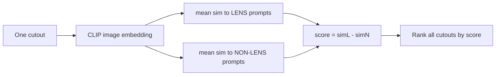

# 04 — Zero-Shot Lens Finding

> Page 03 gave us the tool: a frozen CLIP that scores how well any image matches any sentence. This page turns that tool into a **lens detector** — and, just as importantly, into an *honestly evaluated* one. Two halves: first, how to **score** a cutout with prompts and a threshold; second, how to **measure** the result when the thing you're hunting is rare. That second half is where Week 3's confusion-matrix literacy pays off, because for rare objects **accuracy is a liar**.

---

## Part A — From Prompts to a Lens Score

### Cosine similarity in one minute

CLIP gives every image and every prompt a vector. To compare two vectors we use **cosine similarity**: the cosine of the angle between them. Normalise both vectors to length 1, take their dot product, and you get a number from −1 (opposite) through 0 (unrelated) to +1 (same direction).

```python
import torch.nn.functional as F
# image_emb: (1, D), text_emb: (num_prompts, D)
image_emb = F.normalize(image_emb, dim=-1)
text_emb  = F.normalize(text_emb,  dim=-1)
sims = image_emb @ text_emb.T        # (1, num_prompts), each in [-1, 1]
```

Why cosine and not a raw dot product? Because we care about *direction* (what the vector means), not *magnitude* (how big it happens to be). Normalising removes the length and leaves only the meaning. (You met `F.normalize`-style thinking implicitly in Week 2's feature scaling — same instinct.)

### One prompt is fragile; use a bank

A single prompt like `"a gravitational lens"` is brittle — CLIP might fixate on the wrong word ("lens" as in camera). The robust trick is to use a **bank** of several lens prompts and several non-lens prompts, then average. Here's the starting bank from the project (refine it yourself):

**Lens prompts:**

- `"a strong gravitational lens with an Einstein ring"`
- `"a gravitational lens arc next to a galaxy"`
- `"multiple images of a background source due to gravitational lensing"`

**Non-lens prompts:**

- `"a normal galaxy without gravitational lensing"`
- `"a spiral galaxy with curved arms but no gravitational lens arc"`
- `"a smooth elliptical galaxy with no lensing features"`

Note how the non-lens prompts deliberately call out the **decoys** from page [`02`](02-strong-lens-morphologies.md) (spiral arms!). Good prompts encode what you know about the failure modes.

### The lens score

For each image, compute its similarity to every prompt, average within each group, and subtract:

```
score = mean(similarity to lens prompts) − mean(similarity to non-lens prompts)
```

A **positive** score means "this image looks more like the lens descriptions than the non-lens ones"; a **negative** score means the opposite. This single number is your detector's output — a *ranking* signal. Sort the whole test set by it and the lenses should float toward the top.



Text fallback: embed a cutout once, measure its average similarity to the lens prompts and to the non-lens prompts, subtract to get a single score, then rank every cutout by that score.

### Turning a score into a yes/no: the threshold

Ranking is great, but eventually you must *decide*. Pick a **threshold** `t`: call everything with `score ≥ t` a "lens," everything below "not a lens." Raising `t` makes the detector pickier (fewer calls, more confident); lowering it casts a wider net. The right `t` depends entirely on what you're optimising — which brings us to metrics.

---

## Part B — Evaluating a Rare-Object Search

### Why accuracy lies

Strong lenses are rare. Suppose your test set is 95% non-lenses and 5% lenses. A lazy model that screams **"not a lens"** at every single image scores **95% accuracy** — and finds exactly **zero** lenses. Accuracy rewarded it for doing nothing useful.

> **Print your class balance first.** The very first analysis cell of the notebook prints how many `0`s and `1`s are in train and test. That number dictates everything: if the positive class is small, accuracy is meaningless and you must use precision/recall. This is the single most important habit of rare-object ML.

### Precision and recall (the right tools)

Build the Week-3 confusion matrix again, but with lensing names:

| | Predicted lens | Predicted not-lens |
|---|---|---|
| **Actually lens** | True Positive (TP) | False Negative (FN) — *a missed lens* |
| **Actually not-lens** | False Positive (FP) — *a false alarm* | True Negative (TN) |

- **Precision = TP / (TP + FP)** — of the cutouts I *flagged* as lenses, what fraction really are? (Low precision = drowning in false alarms.)
- **Recall = TP / (TP + FN)** — of all the *real* lenses, what fraction did I catch? (Low recall = missing the very objects I'm hunting.)
- **F1** — the harmonic mean of precision and recall, one number when you want a single summary.

There's a tug-of-war: crank the threshold up and precision rises but recall falls (you only flag slam-dunks and miss subtle lenses); drop it and recall rises but precision falls (you catch more lenses but wade through false alarms). You can't maximise both at once.

### ROC and precision-recall curves

A threshold is one operating point. To see the *whole* trade-off, sweep the threshold across all values and plot the result:

- **ROC curve** — true-positive rate vs false-positive rate as the threshold moves. The **area under it (ROC-AUC)** summarises ranking quality: 1.0 is perfect, 0.5 is random. ROC-AUC is threshold-independent — it answers "does the score rank lenses above non-lenses?"
- **Precision-recall (PR) curve** — precision vs recall as the threshold moves. For **imbalanced** problems like ours, the PR curve is often *more informative* than ROC because it focuses on the rare positive class.

```python
from sklearn.metrics import roc_auc_score, RocCurveDisplay, PrecisionRecallDisplay
auc = roc_auc_score(y_true, scores)          # ranking quality, threshold-free
RocCurveDisplay.from_predictions(y_true, scores)
PrecisionRecallDisplay.from_predictions(y_true, scores)
```

Report **ROC-AUC** for "how good is the ranking?" and use the **PR curve** to pick a threshold that matches your goal.

### What goal? Precision vs recall in real surveys

Real lens-hunting pipelines usually optimise **precision** at the cost of some recall. Why? Because the next step after the model is a *human expert* (or a follow-up telescope) who confirms each candidate, and human time is expensive. A pipeline that sends 1,000 "candidates" that are 95% junk wastes everyone's time; one that sends 100 candidates that are 80% real is gold. Missing a few lenses (lower recall) is acceptable when the survey will image millions of galaxies anyway. We return to this human-in-the-loop logic in [Week 5](../Week-5/).

---

## The Error Gallery: Where Science Happens

Metrics tell you *how well*; the error gallery tells you *why*. After scoring, pull out:

- **Top true positives** — highest-scoring real lenses. Do they share a look (bright obvious rings)?
- **Worst false positives** — high-scoring non-lenses. *Expect spirals and ring galaxies here.* This is the spiral-arm/arc confusion from page [`02`](02-strong-lens-morphologies.md), made concrete.
- **Worst false negatives** — real lenses CLIP scored low. Often subtle arcs, faint sources, or odd colours/domain quirks.

For each, ask the question that makes this a *science* project, not a Kaggle chase: **is this failure physically understandable?** A false positive on a tight face-on spiral isn't CLIP being stupid — it's CLIP correctly noticing "curved bright structure," which is genuinely ambiguous. Naming that is the deliverable.

---

## Common Pitfalls

| Symptom | Cause | Fix |
|---|---|---|
| Scores all ≈ 0 or identical | Forgot to **normalise** embeddings before the dot product. | `F.normalize(emb, dim=-1)` on both image and text vectors. |
| "94% accurate!" reported as success | Class imbalance — the trivial all-negative model scores high too. | Report **precision/recall/ROC-AUC**; show the class balance. |
| ROC-AUC looks great, precision is awful | ROC can look rosy on imbalanced data. | Also plot the **precision-recall** curve and read precision at your chosen recall. |
| Threshold picked arbitrarily | No link to a goal. | Choose `t` from the PR curve to hit a target precision (survey-style). |
| `roc_auc_score` errors / flipped | Passed predicted labels, or scores with the sign reversed. | Pass continuous **scores** (not 0/1), and check higher score = more lens-like. |

---

## Quick Self-Check

1. Why do we use cosine similarity instead of a raw dot product to compare CLIP embeddings?
2. Write the lens score in words, given lens-prompt and non-lens-prompt similarities.
3. A model labels every image "not a lens" on a set that's 96% non-lenses. What's its accuracy, and what's its recall on lenses?
4. Define precision and recall in lens terms, and say which one a survey usually prioritises and why.
5. Why is a precision-recall curve often more useful than an ROC curve for this dataset?

<details>
<summary>Answers</summary>

1. Because we care about the *direction* (meaning) of the embeddings, not their magnitude; normalising to unit length and taking the dot product (cosine) removes magnitude and compares meaning.
2. score = (mean similarity to the lens prompts) − (mean similarity to the non-lens prompts); positive means more lens-like.
3. Accuracy ≈ 96% (it's right on every non-lens), but recall on lenses is **0%** — it catches none of the real lenses. Accuracy is misleading here.
4. Precision = fraction of flagged cutouts that are truly lenses (TP/(TP+FP)); recall = fraction of real lenses found (TP/(TP+FN)). Surveys usually prioritise **precision**, because each candidate costs scarce human/telescope follow-up time.
5. Because the dataset is imbalanced (few positives); the PR curve focuses on performance on the rare positive class, whereas ROC can look deceptively good when negatives dominate.

</details>

---

## External Resources

- 📘 [scikit-learn — ROC curve and `roc_auc_score`](https://scikit-learn.org/stable/modules/generated/sklearn.metrics.roc_auc_score.html).
- 📘 [scikit-learn — precision-recall curve guide](https://scikit-learn.org/stable/auto_examples/model_selection/plot_precision_recall.html).
- 📘 [scikit-learn — precision, recall, F1 definitions](https://scikit-learn.org/stable/modules/model_evaluation.html#precision-recall-f-measure-metrics).
- 📺 [StatQuest — ROC and AUC clearly explained](https://www.youtube.com/watch?v=4jRBRDbJemM).
- 📘 [Google ML Crash Course — classification thresholds and ROC](https://developers.google.com/machine-learning/crash-course/classification/roc-and-auc).
- 📘 [Hugging Face — zero-shot image classification task](https://huggingface.co/docs/transformers/en/tasks/zero_shot_image_classification).

---

⬅️ Previous: [`03-vision-language-models-and-clip.md`](03-vision-language-models-and-clip.md) | ➡️ Next: [`05-project-task.md`](05-project-task.md) | 📚 Week hub: [`README.md`](README.md)
