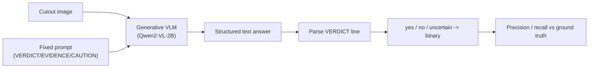

# 01 — VLM Prompting for Science

> Week 4's CLIP gave us a *number*: how well does this cutout match the sentence "a gravitational lens"? Useful for ranking, but mute — it can't tell you *why*. This week we upgrade to a **generative** vision–language model that actually writes about the image. That power comes with a catch: a model that can describe anything can also *make things up*. This page is about getting a scientific, reproducible answer out of a chatty model — the prompt is the instrument, and like any instrument it must be calibrated.

---

## Two Kinds of Vision–Language Model

Both CLIP and this week's model are "VLMs," but they do different jobs.

| | CLIP (Week 4) | Generative VLM (Week 5) |
|---|---|---|
| What it outputs | A **similarity score** between an image and each text prompt | **Free text** — sentences describing the image |
| How you use it | Rank/score cutouts | Ask questions, get explanations |
| Strength | Fast, cheap, great for ranking thousands | Rich, human-readable *evidence* |
| Weakness | No explanation, prompt-sensitive | Slow, can **hallucinate**, harder to score |
| Analogy | A meter that reads "0.42 lens-like" | A junior assistant who says "I see a faint arc on the left" |

CLIP is a *classifier by comparison*; a generative VLM is a *describer*. This week we want the description — the evidence and the caveats — because the whole point of the capstone is to interrogate *how* a model reaches its verdict, not just what number it emits.

Examples of generative VLMs: open models like **Qwen2-VL**, **LLaVA**, and **InternVL** (run on your own GPU), and hosted APIs like **Gemini** and **GPT-4o**. This track's default is the open **`Qwen/Qwen2-VL-2B-Instruct`**, which runs on a Colab T4 with no API key.

---

## The Prompt Is the Instrument

With CLIP you engineered short label-like prompts. With a generative VLM you write **instructions**: who the model is, what to look for, and — crucially — *what format to answer in*. A vague prompt gets you a vague paragraph you can't score. A precise prompt gets you a structured answer you can parse and evaluate.

Here is the fixed template we use this week. Every image gets the *exact same* prompt — that consistency is what makes the results comparable and the experiment reproducible.

```text
You are assisting an astronomer reviewing telescope cutouts for strong gravitational lensing.

Look at this image. Strong lensing shows clear arcs, partial Einstein rings, or multiple images of a background source.

Answer in this format:
VERDICT: yes | no | uncertain
EVIDENCE: one or two sentences describing what you see (or do not see)
CAUTION: one sentence about what could be confused with lensing (e.g. spiral arms, mergers)
```

Why this shape works:

- **A role** ("assisting an astronomer") nudges the model toward careful, domain-appropriate language.
- **A definition** ("arcs, partial rings, multiple images") anchors it to the real features from [Week 4](../Week-4/02-strong-lens-morphologies.md), reducing guesswork.
- **A fixed output format** turns prose into fields you can parse. `VERDICT:` is the line you'll map to a label; `EVIDENCE` and `CAUTION` are the human-readable audit trail.
- **Asking for a caution** forces the model to name its own failure modes — often revealing whether it understands the arc/spiral ambiguity or is bluffing.

---

## Parsing a Structured Answer

Because the format is fixed, parsing is simple string work — grab the `VERDICT:` line and normalise it:

```python
def parse_verdict(text):
    for line in text.splitlines():
        if line.strip().upper().startswith("VERDICT"):
            val = line.split(":", 1)[1].strip().lower()
            if "yes" in val:
                return "yes"
            if "uncertain" in val:
                return "uncertain"
            if "no" in val:
                return "no"
    return "uncertain"   # default when the model ignores the format
```

Then map the three verdicts to a binary prediction so you can score it against the `0/1` ground truth (page [`02`](02-hallucination-and-human-in-the-loop.md) discusses how to treat `uncertain` — as a miss, or as a separate "send to human" bucket).

> **Design for the model misbehaving.** Sometimes the VLM ignores your format and writes a paragraph. Your parser must have a sensible default (here, `uncertain`) rather than crashing. Robust parsing is part of the experiment, not an afterthought.

---

## Temperature and Reproducibility

Generative models sample their next word from a probability distribution. **Temperature** controls how random that sampling is:

- **Low temperature (≈0):** near-greedy — the model almost always picks its most likely token. More deterministic, more repeatable. **Use this for science.**
- **High temperature (>0.7):** creative, varied, and — for our purposes — a reproducibility nightmare. The same image can get "yes" one run and "no" the next.

For an experiment you want to be able to *rerun and defend*, set temperature low (or use greedy decoding) and fix random seeds where the framework allows. Even then, be honest in your writeup: generative models are not perfectly deterministic across hardware and library versions, and that residual wobble is itself a finding worth noting. (You'll quantify it in a Week-5 stretch goal by paraphrasing the prompt and measuring how much the verdicts move.)



Text fallback: feed the cutout plus the fixed prompt to the VLM; it returns structured text; parse the VERDICT line; map it to a binary label; score against the expert ground truth.

---

## Open Model vs Hosted API

The track defaults to an **open model** for good reasons, but you should know the trade-off.

| | Open model on Colab (default) | Hosted API (Gemini / GPT-4o) |
|---|---|---|
| Setup | `pip install` + download weights | Sign up, get an API key |
| Cost | Free (uses your Colab GPU) | Free tier or paid per call |
| Privacy / reproducibility | Runs locally; weights are pinned | Model can change under you silently |
| Capability | Smaller (2B) — solid, not superhuman | Often stronger reasoning |
| Best for | This track: zero-setup, reproducible | If you already have a key and want max quality |

Our notebook uses `Qwen/Qwen2-VL-2B-Instruct` by default and includes a **commented** API cell you can switch to. The *lesson* — how to prompt, parse, score, and distrust a VLM — is identical either way. The point was never the specific model; it's the method.

---

## Common Pitfalls

| Symptom | Cause | Fix |
|---|---|---|
| Answer is an unparseable paragraph | Prompt didn't pin a format. | Use the fixed `VERDICT/EVIDENCE/CAUTION` template; default to `uncertain` on parse failure. |
| Same image flips verdict each run | Temperature too high. | Set low temperature / greedy decoding; fix seeds; note residual nondeterminism. |
| Model always answers "yes" | Leading prompt ("confirm this lens"). | Keep wording neutral; verify with precision/recall, not vibes. |
| Out-of-memory loading the model | Full-precision weights on a T4. | Load in half precision; one image per call. |
| Comparing runs with different prompts | Prompt drift between images. | Freeze one prompt string and reuse it for every cutout. |

---

## Quick Self-Check

1. What does a generative VLM give you that CLIP does not?
2. Why do we force a fixed `VERDICT/EVIDENCE/CAUTION` output format?
3. What does temperature control, and what setting suits a reproducible experiment?
4. Your parser hits an answer with no `VERDICT:` line. What should it do?
5. Give one reproducibility advantage of an open local model over a hosted API.

<details>
<summary>Answers</summary>

1. Natural-language *evidence* — a description of what it sees and what could fool it — rather than just a similarity score.
2. So the free-form text becomes parseable fields we can map to labels and score consistently across every image; it also forces the model to commit to a verdict and name its own caveats.
3. Temperature controls the randomness of token sampling; a **low** temperature (near-greedy) gives more deterministic, repeatable answers, which is what science needs.
4. Fall back to a sensible default (we use `uncertain`) rather than crashing — robust parsing is part of the experiment.
5. The weights are pinned and run locally, so the model can't silently change under you (and there's no per-call cost or data leaving your session), making reruns more reproducible.

</details>

---

## External Resources

- 📘 [Hugging Face — Qwen2-VL model card](https://huggingface.co/Qwen/Qwen2-VL-2B-Instruct) and [vision-language / image-text-to-text task guide](https://huggingface.co/docs/transformers/en/tasks/image_text_to_text).
- 📘 [Prompting guide — vision/multimodal prompting basics](https://www.promptingguide.ai/).
- 📘 [LLaVA project page](https://llava-vl.github.io/) — a widely used open VLM.
- 📘 [Google AI Studio — Gemini API (free tier)](https://aistudio.google.com/) — the hosted-API fallback.
- 📺 [What is temperature in language models? (short explainer)](https://www.youtube.com/watch?v=Vpr4mQMbFOo).

---

➡️ Next: [`02-hallucination-and-human-in-the-loop.md`](02-hallucination-and-human-in-the-loop.md) | 📚 Week hub: [`README.md`](README.md)
