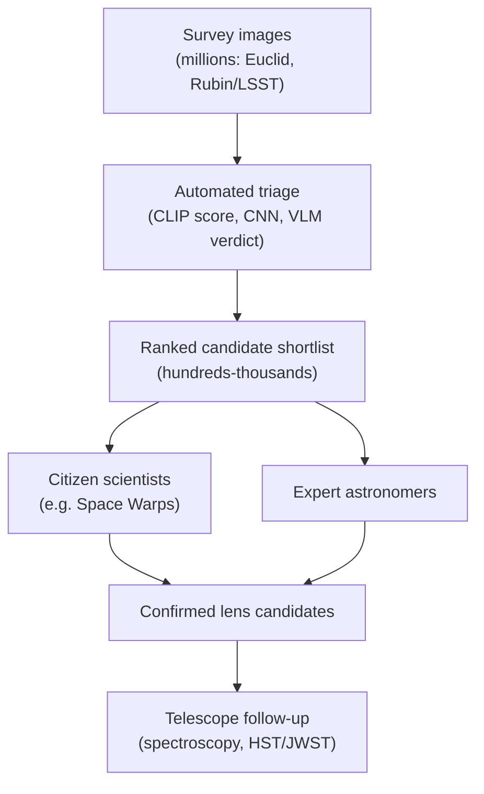

# 02 — Hallucination and the Human in the Loop

> A VLM will look at an empty patch of sky and tell you, in fluent and confident prose, about the beautiful Einstein ring it sees. There is no ring. This is **hallucination**, and it is the single most important thing to understand before trusting a generative model with science. This page is about why it happens, why it's especially dangerous in astronomy, and the workflow real surveys use to get value from imperfect models anyway: keep a human in the loop.

---

## What Hallucination Is

A **hallucination** is when a model states something that is not supported by its input — confidently describing features that simply aren't there. A VLM asked "is this a lens?" is built to produce a fluent, plausible-sounding answer. It is *not* built to say "I genuinely cannot tell." So when the image is ambiguous or empty, it often fills the gap with something that *sounds* right: "a faint arc curves around the central galaxy, consistent with strong lensing."

The trap is the packaging. The hallucinated claim arrives in the same calm, authoritative tone as a correct one. There is no tremor in the model's voice when it's wrong.

> **Confidence is not correctness.** A VLM's fluency is a property of its *language*, not its *evidence*. It can be completely wrong and completely eloquent at the same time. Treat every verdict as a claim to be checked against the pixels, never as a fact because it was stated well.

---

## Why It's Especially Dangerous in Astronomy

In a chatbot, a hallucination is annoying. In a science pipeline, it corrupts the result. Two reasons it bites harder here:

- **Rare objects amplify false positives.** Lenses are a tiny fraction of cutouts (you measured this imbalance in Week 4). If a model hallucinates "lens!" even a few percent of the time on the *huge* majority-class of non-lenses, your candidate list drowns in false alarms — the exact failure precision was invented to catch.
- **The features are genuinely ambiguous.** As page [`03`](03-arcs-vs-spirals-confusion-physics.md) details, spiral arms, tidal tails, and ring galaxies really do resemble arcs. So a hallucination here isn't random noise — it's the model latching onto real, misleading structure. That makes it *more* convincing and *harder* to dismiss.

A model that says "yes, a lens" on a spiral galaxy isn't malfunctioning in an obvious way. It's doing something subtly worse: giving a wrong answer that a hurried human might nod along to.

---

## Spotting Hallucination in Your Own Results

You don't need special tools — you need to compare the model's *evidence* against the *image and the label*. Three tells:

1. **Evidence that describes absent features.** The model cites "a clear arc" on a cutout that is a smooth blob. Cross-check `EVIDENCE` against what you can actually see.
2. **Overconfidence on the hard negatives.** Feed it known non-lenses that *look* lens-ish (spirals, rings). A model that says "yes" with elaborate justification is hallucinating structure.
3. **Verdict instability.** Paraphrase the prompt or re-run; if the verdict flips, the model was never really "sure" — the confidence was cosmetic. (This is a Week-5 stretch goal.)

Your deliverable this week explicitly asks for **at least two concrete hallucination examples** — screenshots of the model confidently claiming a lens where the label and your eyes disagree. Hunting these down is the point, not an embarrassment.

---

## The Human in the Loop

If models hallucinate, why use them at all? Because at survey scale, humans can't look at everything — but they *can* look at a shortlist. The real workflow is a **funnel**: cheap automated tools triage millions of images down to a human-reviewable candidate list.

Text fallback: millions of survey images are triaged by automated tools (CLIP/CNN/VLM) into a ranked shortlist of hundreds to thousands; citizen scientists and expert astronomers vet that shortlist; confirmed candidates go to telescope follow-up.

The model's job is not to be *right* — it's to be a good *filter*, surfacing the promising few so scarce human and telescope time is spent well. Projects like **Space Warps** (Zooniverse) crowd-source exactly this vetting: tens of thousands of volunteers inspect model-surfaced candidates.

---

## Why Pipelines Optimise Precision

This funnel is *why* real lens searches tune for **precision** over recall (the trade-off you plotted in [Week 4](../Week-4/04-zero-shot-lens-finding.md)):

- The step after the model is **expensive human attention** (or a telescope). Every false positive on the shortlist wastes it.
- Missing a few lenses (lower recall) is tolerable — surveys image so many galaxies that plenty of lenses remain to be found. Flooding experts with junk (low precision) is not.
- So the sensible operating point flags fewer candidates but makes each one *count* — a shortlist an expert can actually work through.

Where you set that threshold is a judgement call about how much human review you can afford. Answering "where would you set it, and how many candidates would you send a human?" is one of your capstone reflection questions.

> **The honest promise of AI here.** These tools don't *replace* the astronomer — they *route her attention*. The intelligence in the pipeline is the partnership: a fast, tireless, fallible filter feeding a slow, expert, accountable judge. Knowing which half does which job is the whole lesson of this track.

---

## Quick Self-Check

1. Define hallucination in the context of a VLM reading a cutout.
2. Why is "confidence is not correctness" a critical warning for generative models?
3. Give two reasons hallucination is more damaging in a rare-object astronomy pipeline than in a chatbot.
4. Describe the survey "funnel" and where the model sits in it.
5. Why do real lens-finding pipelines optimise precision rather than recall?

Answers

1. When the model describes lensing features (arcs, rings) that are not actually present in the image, stated as if they were real.
2. Because a VLM's fluent, authoritative tone is a property of its language generation, not of the visual evidence — it can be eloquent and wrong simultaneously, so verdicts must be checked against the pixels.
3. Rare positives mean even a small false-positive rate floods the candidate list; and the decoy features (spirals, rings, tidal tails) are genuinely lens-like, so hallucinations are convincing and hard to dismiss.
4. Automated tools triage millions of survey images into a ranked shortlist; humans (citizen scientists + experts) vet the shortlist; confirmed candidates get telescope follow-up. The model is the early, cheap **filter**, not the final judge.
5. The next step is scarce human/telescope time, so false positives are costly; missing some lenses (lower recall) is acceptable because surveys image huge numbers of galaxies, while low precision wastes experts' attention.

---

## External Resources

- 🌌 [Space Warps (Zooniverse)](https://www.zooniverse.org/projects/aprajita/space-warps) — citizen-science lens vetting in action.
- 📘 [Rubin Observatory / LSST — survey scale and science](https://www.lsst.org/about).
- 📄 [Metcalf et al. 2019 — the Strong Gravitational Lens Finding Challenge (arXiv)](https://arxiv.org/abs/1802.03609) — how the community benchmarks automated finders (and their false-positive problem).
- 📘 [Google — what are AI hallucinations?](https://cloud.google.com/discover/what-are-ai-hallucinations).
- 📄 [Marshall et al. 2016 — Space Warps: crowd-sourced lens discovery (arXiv)](https://arxiv.org/abs/1504.06148).

---

⬅️ Previous: [`01-vlm-prompting-for-science.md`](01-vlm-prompting-for-science.md) | ➡️ Next: [`03-arcs-vs-spirals-confusion-physics.md`](03-arcs-vs-spirals-confusion-physics.md) | 📚 Week hub: [`README.md`](README.md)
