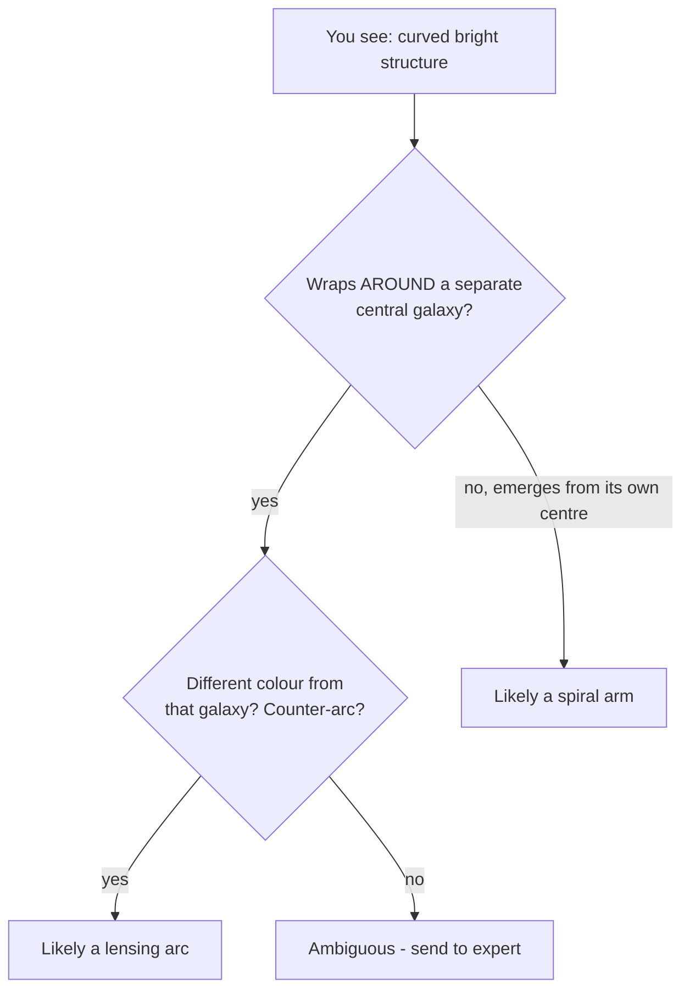

# 03 — Arcs vs Spirals: The Physics of Confusion

> Every model you've tested this fortnight — CLIP, and soon the VLM — makes the same mistake: it calls a spiral galaxy a lens. It's tempting to write this off as the model being dumb. It isn't. The confusion is *real*, rooted in the fact that several completely different physical processes all paint **curved, bright structure** onto an image. Humans fall for it too — that's why lens catalogues need expert grading. This page explains the physics of the lookalikes so you can read your models' errors as astrophysics, not just bugs.

---

## One Appearance, Several Causes

A gravitational lens arc and a spiral arm can produce nearly identical patches of curved light, yet nothing about their physics is the same.

| Feature | What makes it | Where the curve "belongs" |
|---|---|---|
| **Lensing arc** | Light of a *background* galaxy bent by a *foreground* mass | Concentric **around a separate foreground galaxy**, at the Einstein radius |
| **Spiral arm** | Density waves in a galaxy's *own* disk triggering star formation | Winds **out from that galaxy's own centre** |
| **Tidal tail** | Two galaxies gravitationally flinging out streams of stars in a **merger** | Trails away from the interacting pair |
| **Ring galaxy** | A head-on collision punching a ring of star formation into a disk | A ring that *is the galaxy's own* structure |
| **Dust lane** | Dust in a disk absorbing starlight (often edge-on) | A dark/curved band within a single galaxy |

The eye — and a model — sees "curved bright thing." The *physics* is what distinguishes them, and physics isn't visible in a single cutout without context.

---

## The One Tell That Actually Works

If you remember one diagnostic, make it this:

> **A true lensing arc curves concentrically around a *separate* foreground galaxy — the lens — sitting at its centre. A spiral arm curves out from the centre of its *own* galaxy.**

That geometric relationship — "is there a distinct massive galaxy that this curve is wrapping *around*, rather than *emerging from*?" — is the single most reliable naked-eye discriminator. Real lens hunters also use **colour** (the lensed background source is often redder/bluer than the foreground lens because it's at a very different distance) and **symmetry** (lensing frequently produces a *counter-arc* or multiple images on the opposite side).

Text fallback: if the curved structure wraps around a separate central galaxy, and especially if it differs in colour or has a counter-arc, it's likely a lensing arc; if it emerges from the galaxy's own centre, it's likely a spiral arm; borderline cases go to an expert.

But notice: **none of these tells are reliable from a low-resolution cutout alone.** Colour can be washed out; a counter-arc can be too faint; the foreground galaxy can sit right on top of the arc. This is precisely why the confusion is fundamental, not lazy.

---

## Why Even Experts Disagree

Lens catalogues (including this track's Euclid dataset) use graded confidence — A, B, C — *because* borderline cases are genuinely undecidable from imaging alone. Definitive confirmation often needs **spectroscopy**: measuring the redshifts (distances) of the central galaxy and the arc separately. If the arc is much farther away than the "lens," it really is a lensed background source. If they're at the same distance, it's intrinsic structure (a spiral arm or a ring galaxy). A single image can't measure redshift, so a single image can't always settle it.

This has a humbling consequence for your capstone: some of your models' "errors" are on images where **the ground-truth label itself is a human judgement call**. When you find a false positive, the honest question isn't "how did the model fail?" but "is this a case a careful astronomer would also flag?" Often the answer is yes.

---

## Reading Your Models' Failures Astrophysically

This is the interpretive skill the capstone rewards. For each misclassification, connect it to the physics above:

- **CLIP/VLM says "lens" on a face-on spiral** → it locked onto curved bright arms. Correct low-level perception, wrong high-level physics (no foreground lens). *Understandable.*
- **"Lens" on a ring galaxy (e.g. Hoag's-Object-like)** → a ring is the textbook Einstein-ring shape; only redshift/context distinguishes them. *Very understandable — a hard case.*
- **"Lens" on a merger with tidal tails** → long curved stellar streams mimic arcs. *Understandable; even the tail's origin (gravity) rhymes with lensing.*
- **Misses a real arc (false negative)** → the arc was faint, or the foreground lens galaxy outshone it, or the cutout resolution buried it. *A sensitivity limit, not stupidity.*

The deliverable asks you to pick specific examples and write this kind of sentence. "The model was wrong" earns nothing; "the model flagged a face-on barred spiral because its arms present the same concentric curved brightness a lensing arc would, and at this resolution the absence of a distinct foreground lens galaxy is not obvious" earns everything.

---

## Common Pitfalls

| Symptom | Cause | Fix |
|---|---|---|
| Dismissing every false positive as a "dumb model" | Ignoring the shared appearance of arcs and arms. | Explain the *physical* lookalike; note the model's low-level perception was often correct. |
| Assuming the ground-truth label is infallible | Borderline lenses are human judgement calls. | Acknowledge label uncertainty; ask whether an expert would also hesitate. |
| Expecting colour/counter-arc tells to always work | Low-resolution cutouts hide them. | Treat the tells as *hints*, not proofs; that's why spectroscopy exists. |
| Confusing a ring galaxy with an Einstein ring | Both are rings. | Remember one is intrinsic structure, the other is lensed background light — distance settles it. |

---

## Quick Self-Check

1. Name three distinct physical phenomena that can all look like a lensing arc.
2. State the single most reliable naked-eye tell for distinguishing a lensing arc from a spiral arm.
3. Why can't a single cutout always settle whether a curved feature is a lens?
4. What measurement definitively separates a lensed background source from intrinsic structure, and why?
5. Rewrite "the model was wrong — it called a spiral a lens" as a proper astrophysical explanation.

Answers

1. Spiral arms (density waves), tidal tails from mergers, and ring galaxies (collisional rings) — also dust lanes/edge-on disks.
2. Whether the curved structure wraps concentrically *around a separate foreground galaxy* (lensing arc) versus emerging from its *own* galaxy's centre (spiral arm).
3. The distinguishing tells (colour difference, counter-arc, a distinct foreground lens) can be faint, washed out, or hidden at low resolution, so the image alone is often ambiguous.
4. Spectroscopy / redshifts: if the arc is at a much greater distance than the central galaxy, it's a lensed background source; if they're at the same distance, it's intrinsic structure. A single image can't measure redshift.
5. e.g. "The model flagged this face-on spiral because its bright, curved arms present the same concentric curved brightness a lensing arc would; at this cutout's resolution there's no distinct foreground lens galaxy visible to rule lensing out, so the confusion is physically reasonable."

---

## External Resources

- 🖼️ [ESA/Hubble — gravitational lensing image archive](https://esahubble.org/images/archive/category/gravitationallensing/) (compare arcs to spirals side by side).
- 🖼️ [ESA/Hubble — the Antennae Galaxies (tidal tails from a merger)](https://esahubble.org/images/heic0812c/).
- 📘 [Wikipedia — Ring galaxy](https://en.wikipedia.org/wiki/Ring_galaxy) and [Hoag's Object](https://en.wikipedia.org/wiki/Hoag%27s_Object).
- 📘 [Week 4 — Strong-lens morphologies](../Week-4/02-strong-lens-morphologies.md) and [Week 3 — Lenticulars, mergers and evolution](../Week-3/08-lenticulars-mergers-and-evolution.md).
- 🌌 [Space Warps tutorial — how volunteers tell arcs from lookalikes](https://www.zooniverse.org/projects/aprajita/space-warps/about/research).

---

⬅️ Previous: [`02-hallucination-and-human-in-the-loop.md`](02-hallucination-and-human-in-the-loop.md) | ➡️ Next: [`04-comparing-cnn-clip-and-vlm.md`](04-comparing-cnn-clip-and-vlm.md) | 📚 Week hub: [`README.md`](README.md)
