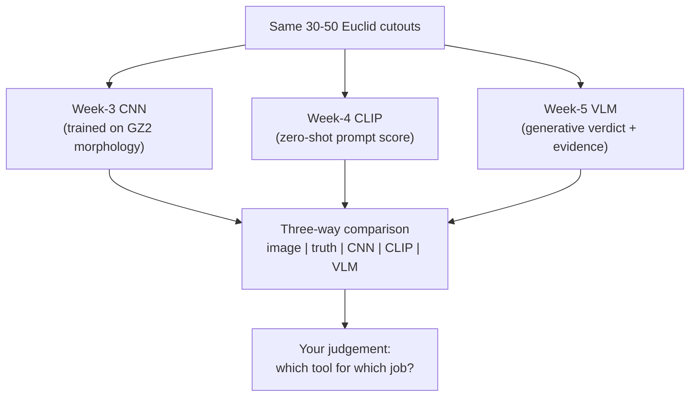

# 04 — Comparing CNN, CLIP, and VLM

> Here is the capstone idea in one sentence: **the right tool depends on the task, and the only way to know is to put them side by side on the same images.** You've built or used three very different systems — a morphology CNN (Week 3), a CLIP zero-shot ranker (Week 4), and a generative VLM (this week). This page frames the head-to-head so that when you build the comparison figure, you're testing a hypothesis, not just making a pretty grid. Spoiler: one of the three is the *wrong tool on purpose*, and understanding *why* is the point.

---

## Three Tools, Three Philosophies

Text fallback: the same 30-50 cutouts are fed to the Week-3 CNN, the Week-4 CLIP ranker, and the Week-5 VLM; their outputs are collected into one comparison table; you then reason about which tool fits the task.

Each embodies a different bet about how to solve vision problems:

- **CNN — supervised specialist.** Learns exactly the classes you trained it on, from labelled examples. Superb *within* its training distribution, helpless outside it.
- **CLIP — zero-shot generalist.** No task-specific training; classify anything you can describe in words. Fast and flexible, but shallow — it matches appearance, not physics.
- **VLM — generative reasoner.** Describes and justifies in natural language. Richest output, but slowest and most prone to hallucination.

---

## The CNN Is the Wrong Tool — On Purpose

The Week-3 `GalaxyCNN` was trained to sort **Galaxy Zoo 2** images into morphology classes (spiral, elliptical, and friends) on **SDSS** data. We now run it on **Euclid lens cutouts**. Expect it to do *badly*, for two compounding reasons:

1. **Wrong task.** It has no "lens" class. It can only answer "which morphology?", so a genuine Einstein ring gets shoehorned into whatever training class it least-poorly resembles — often "spiral" or "irregular". The question we care about (lens or not?) is one it was never built to answer.
2. **Domain shift.** Even setting the task aside, it learned on SDSS Galaxy Zoo JPGs, not Euclid cutouts — different instrument, resolution, colour processing, and noise. Its learned features may not transfer.

This is not a failure to fix; it's a **demonstration**. It makes visceral a lesson that's easy to nod along to but hard to internalise: *a model is only valid on the task and data distribution it was trained for.* A powerful, well-trained CNN can still be completely wrong when pointed at the wrong problem. That humility is worth an entire week.

> **What "interpret the CNN's mispredictions" means.** You're not debugging the CNN. You're narrating *why* a morphology classifier necessarily flails at lens finding — connecting its outputs to the wrong-task + domain-shift argument. That narration is the deliverable.

---

## The Scorecard

The core comparison table (you'll fill an empirical version in the notebook):

| System | What it outputs | Strength | Weakness |
|--------|-----------------|----------|----------|
| **Week-3 CNN** | Morphology class | Reads disk/bulge/spiral structure well | Not trained for arcs; wrong task + domain shift; may label lenses as spiral/irregular |
| **Week-4 CLIP** | Lens-vs-non-lens score | Fast zero-shot ranking; no training; scales to millions | Prompt-sensitive; confuses arcs with spiral arms; no physics |
| **Week-5 VLM** | Verdict + natural-language evidence | Human-readable reasoning; can name caveats | Hallucinates; slow; harder/costlier to run at scale |

No row is the "winner." Each is the best tool for a *different* job: the CNN for morphology (its actual job), CLIP for fast triage of huge candidate sets, the VLM for explaining a shortlist to a human. The skill is matching tool to task.

---

## What to Look For in Your Comparison

When you build the grid `image | true label | CNN pred | CLIP score | VLM verdict + quote`, hunt for patterns, not just accuracy:

- **Agreement on easy cases.** On an obvious bright ring, do CLIP and the VLM both fire? Consensus is (weak) evidence of a real detection.
- **Correlated failures.** Do CLIP *and* the VLM both call the same spiral a lens? That's the shared arc/spiral confusion from page [`03`](03-arcs-vs-spirals-confusion-physics.md) — a *systematic* error, not random noise.
- **The CNN's irrelevance.** Its morphology labels won't even be in the right vocabulary. Note how its "confidence" is meaningless for this task — a caution about trusting any model's confidence out of domain.
- **Evidence quality.** When the VLM is right, is its `EVIDENCE` actually about a real arc, or did it get the right answer for the wrong reason? (A correct verdict with hallucinated evidence is still a warning sign.)

---

## From Comparison to Judgement

The capstone reflection asks you to turn this table into a *recommendation*. A strong answer reasons like an engineer building a real pipeline:

- Use **CLIP** (or a trained classifier) to triage millions of cutouts down to a shortlist — cheap, fast, tunable for precision.
- Use a **VLM** to generate human-readable evidence for the shortlist, helping experts prioritise — but never as the final word, because it hallucinates.
- Keep a **human** as the decision-maker, with spectroscopic follow-up as ground truth (page [`02`](02-hallucination-and-human-in-the-loop.md)).
- Do **not** use an out-of-domain morphology CNN for lens finding — the Week-3 experiment shows why.

That is the arc of the whole track: from training a model, to scoring with one, to *judging* several — and knowing that the intelligence in a real system is the human–AI partnership, not any single network.

---

## Quick Self-Check

1. In one line each, give the core strength and weakness of the CNN, CLIP, and VLM for lens finding.
2. State the two compounding reasons the Week-3 CNN performs poorly on Euclid lens cutouts.
3. Why is running the CNN here a "demonstration" rather than a bug to fix?
4. If CLIP and the VLM both flag the same spiral as a lens, what does that tell you?
5. Sketch a sensible real-world pipeline using these tools plus humans.

Answers

1. CNN: strong at morphology it was trained on, but wrong task + domain shift for lenses. CLIP: fast zero-shot ranking, but prompt-sensitive and confuses arcs with spirals. VLM: rich natural-language evidence, but hallucinates and is slow/costly.
2. Wrong task (it has no lens class — only morphology) and domain shift (trained on SDSS Galaxy Zoo JPGs, not Euclid cutouts).
3. Because it illustrates the general principle that a model is only valid on its training task and data distribution; the poor result *is* the lesson, not something to repair.
4. It's a **systematic**, physically grounded error — the shared arc/spiral-arm confusion — rather than random noise, so both models are being fooled by the same real ambiguity.
5. CLIP triages millions of cutouts into a precision-tuned shortlist; a VLM adds human-readable evidence for that shortlist; expert humans (with spectroscopic follow-up) make the final call; an out-of-domain morphology CNN is not used for lens finding.

---

## External Resources

- 📄 [Huertas-Company & Lanusse 2023 — Deep Learning for Galaxy Surveys (arXiv)](https://arxiv.org/abs/2210.01813) — surveys CNNs, foundation models, and lens finding together.
- 📄 [Radford et al. 2021 — CLIP (arXiv:2103.00020)](https://arxiv.org/abs/2103.00020) and [Metcalf et al. 2019 — Lens Finding Challenge (arXiv)](https://arxiv.org/abs/1802.03609).
- 📘 [Distribution shift / out-of-distribution generalisation (overview)](https://en.wikipedia.org/wiki/Domain_adaptation).
- 📘 [Week 3 — the morphology CNN](../Week-3/02-building-a-cnn.md) and [Week 4 — CLIP zero-shot lens finding](../Week-4/04-zero-shot-lens-finding.md).

---

⬅️ Previous: [`03-arcs-vs-spirals-confusion-physics.md`](03-arcs-vs-spirals-confusion-physics.md) | ➡️ Next: [`05-project-task.md`](05-project-task.md) | 📚 Week hub: [`README.md`](README.md)
